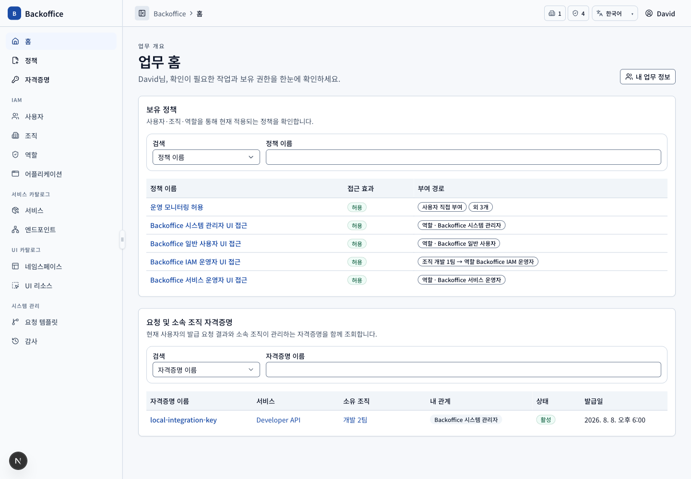
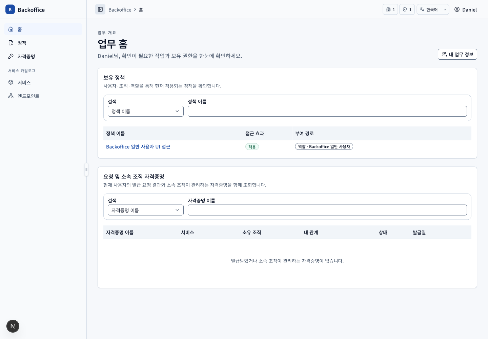

# Access Governance 메뉴별 PRD

현재 구현된 메뉴를 사용자 시나리오, 실제 화면, UI 요구사항과 필요한 서버 기능으로 연결한다. 상세 규칙의 원본은 [UI 기능 요구사항](../ui-functional-requirements.md)과 [서버 기능 요구사항](../server-functional-requirements.md)이며, 작성·캡처 절차는 [PRD 작성·갱신 가이드](../prd-authoring-guide.md)를 따른다.

## 문서 범위

| 영역            | 메뉴 PRD                                                                                        | 주요 사용자                                                            |
| --------------- | ----------------------------------------------------------------------------------------------- | ---------------------------------------------------------------------- |
| 공통            | [홈](home.md), [정책](policies.md), [자격증명](credentials.md)                                  | 모든 사용자, 요청자, 승인자, 정책 운영자                               |
| IAM             | [사용자](users.md), [조직](organizations.md), [역할](roles.md), [어플리케이션](applications.md) | 모든 사용자(사용자·조직 조회, 어플리케이션), IAM 운영자, 시스템 관리자 |
| 서비스 카탈로그 | [서비스](services.md), [엔드포인트](service-endpoints.md)                                       | 서비스 운영자, 조직장, 시스템 관리자                                   |
| UI 카탈로그     | [네임스페이스](namespaces.md), [UI 리소스](ui-resources.md)                                     | 일반 사용자(네임스페이스 조회), UI 리소스 관리자, 시스템 관리자        |
| 시스템 관리     | [결재](requests.md), [결재 템플릿](request-templates.md), [감사](audit.md)                      | 시스템 관리자, 부여된 전문 운영자                                      |

## 공통 권한 시나리오

| ID         | 사용자·선행 조건                    | 사용자 흐름·완료 결과                                                                                   | UI 요구사항                                    | 필요한 서버 기능                                                                                            | 화면                                         |
| ---------- | ----------------------------------- | ------------------------------------------------------------------------------------------------------- | ---------------------------------------------- | ----------------------------------------------------------------------------------------------------------- | -------------------------------------------- |
| COM-SCN-01 | David 또는 유효 UI 정책 보유 사용자 | 보유 정책을 SSR에서 계산해 허용 메뉴·view·action만 표시한다.                                            | `COM-011~019`, `COM-025`, `COM-029`            | 세션 기반 UI 리소스 실효 권한 query, 상위 리소스 활성 상속, deny 우선 계산 (`COM-S003`, `COM-S008~009`)     |     |
| COM-SCN-02 | Daniel, 일반 사용자 UI 정책만 보유  | IAM 영역에서 사용자·조직과 소속 조직 어플리케이션을 조회하되 퇴직 사용자와 IAM 관리 기능은 보지 않는다. | `COM-016~017`, `COM-029`, `USR-006`            | query 범위와 command 권한을 분리하고 일반 사용자에게 퇴직 사용자를 반환하지 않는다 (`COM-S003`, `USR-S002`) |  |
| COM-SCN-03 | 모든 로그인 사용자                  | 검색 조건, 최대 20건 페이지네이션, 행/키보드 상세 이동과 긴 셀 안전 표시를 공통 사용한다.               | `COM-020`, `COM-023~024`, `COM-027`, `COM-030` | 엔티티별 서버 pagination·filter·total과 존재하지 않는 ID 오류 (`COM-S003`, `COM-S005`, `COM-S010`)          | 각 메뉴 목록 화면                            |

## 캡처 기준

- 기준일: 2026-08-18
- 앱: `pnpm dev:mock`
- locale·viewport: `ko`, 1440×1000
- 기본 사용자: David. 일반 사용자와 403은 Daniel.
- 스크린샷은 현재 fixture와 UI 상태의 증거이며 업무 규칙의 원본이 아니다.
