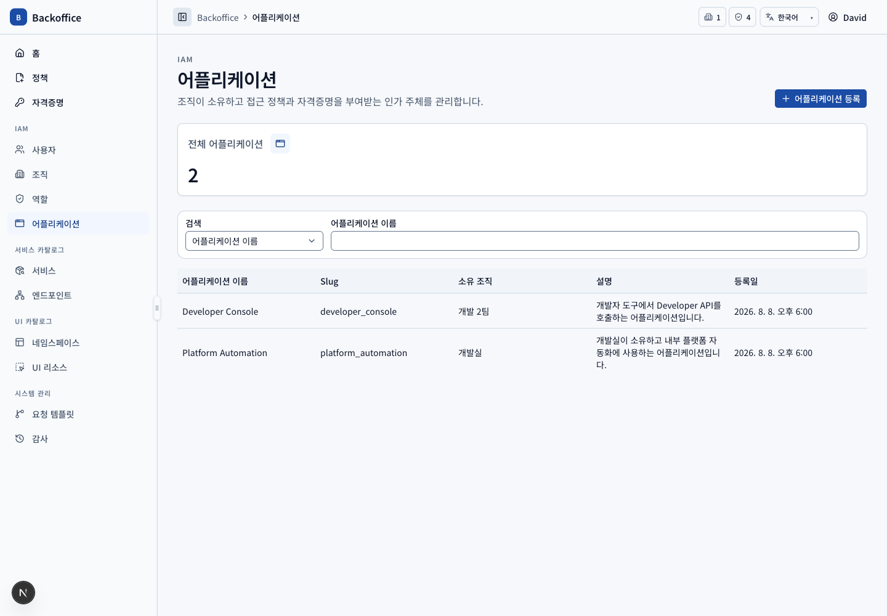
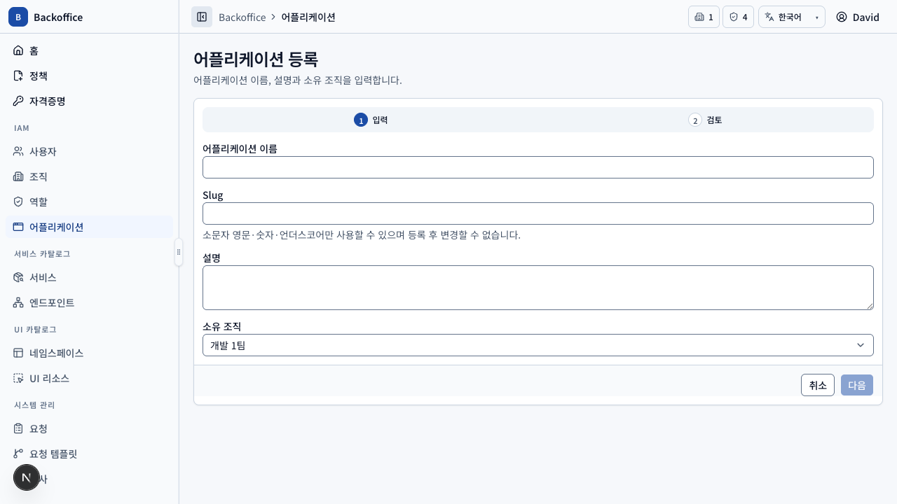
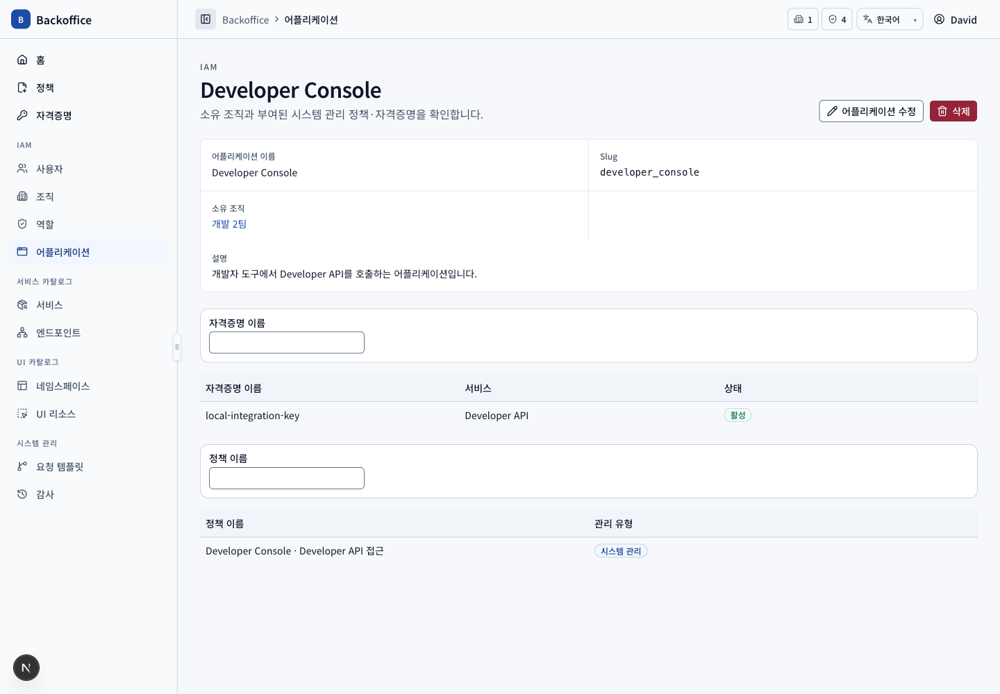

# 어플리케이션 메뉴 PRD

## 개요

- 목표: 자격증명과 시스템 정책을 보유하는 독립 권한 주체를 IAM 영역에서 관리한다.
- routes: `/applications`, `/applications/new`, `/applications/{applicationId}`, `/applications/{applicationId}/edit`
- 주 사용자: 모든 재직 사용자, IAM 운영자, 시스템 관리자
- 원본: UI `APP-001~102`, 서버 `APP-S001~003`

## 대표 화면

| 등록                                                             | 상세                                                 |
| ---------------------------------------------------------------- | ---------------------------------------------------- |
|  |  |

## 사용자 시나리오

| ID         | 사용자·선행 조건                              | 사용자 흐름·완료 결과                                                                                                                             | UI 요구사항                     | 필요한 서버 기능                                                                               | 화면                                                                                         |
| ---------- | --------------------------------------------- | ------------------------------------------------------------------------------------------------------------------------------------------------- | ------------------------------- | ---------------------------------------------------------------------------------------------- | -------------------------------------------------------------------------------------------- |
| APP-SCN-01 | 재직 일반 사용자                              | LSB의 어플리케이션 메뉴에서 소속 조직 소유 어플리케이션만 검색하고 행으로 상세에 진입한다.                                                        | `APP-001~002`, `COM-029`        | 세션 조직 범위의 filter·pagination·total과 상세 접근 검증 (`APP-S001~002`)                     |                                                         |
| APP-SCN-02 | 등록 action·create view 권한                  | 이름·snake_case 어플리케이션 키·설명과 자신의 소속 조직을 입력하고 검토한 뒤 등록해 상세로 이동한다.                                              | `APP-003`, `COM-005`, `COM-026` | 이름·어플리케이션 키 고유성, snake_case, 소유 조직 존재와 세션 조직 범위 검증 (`APP-S001~002`) |                                                  |
| APP-SCN-03 | 상세 view 권한                                | 기본 정보, 소유 자격증명과 자동 부여된 시스템 정책을 독립 목록으로 조회한다.                                                                      | `APP-101`, `COM-030`            | 자격증명·직접 시스템 정책 query와 연결 상세 ID (`APP-S003`, `KEY-S001`, `POL-S018`)            |                                                       |
| APP-SCN-04 | 소유 조직 사용자·수정 action·update view 권한 | 이름·설명·소유 조직을 입력·검토해 저장하되 어플리케이션 키는 읽기 전용으로 유지하고 상세로 이동한다.                                              | `APP-003`, `APP-102`, `COM-026` | 어플리케이션 키 불변, 소유 조직 존재·범위와 권한 재검증 (`APP-S002`)                           |                                                       |
| APP-SCN-05 | 소유 조직 사용자·삭제 action 권한             | 유효한 자격증명이나 자격증명 이력·정책 부여가 있으면 사유와 함께 삭제 버튼이 비활성화되며, 보호 관계가 없을 때만 확인 후 삭제한다.                | `APP-102`                       | 소유 조직 범위와 자격증명·정책 관계를 재검증하는 원자적 삭제 (`APP-S002`)                      |                                                |
| APP-SCN-06 | IAM 운영자·시스템 관리자                      | 전체 조직의 어플리케이션을 조회하고 등록 시 모든 소유 조직을 선택하며 허용된 수정·삭제 기능을 사용한다.                                           | `APP-001~003`, `APP-102`        | 전체 조직 범위 권한과 command별 UI·API 권한 재검증 (`APP-S002`)                                |                                                         |
| APP-SCN-07 | 소유 조직 재직 사용자·자격증명 요청 view 권한 | 상세의 자격증명 생성 버튼으로 발급 요청 페이지에 이동해 현재 어플리케이션과 소유 조직이 선택된 상태에서 서비스·엔드포인트와 요청 정보를 작성한다. | `APP-103`, `KEY-002~003`        | 어플리케이션·소유 조직·요청자 관계와 자격증명 발급 조건 검증 (`KEY-S002`)                      | ,  |
