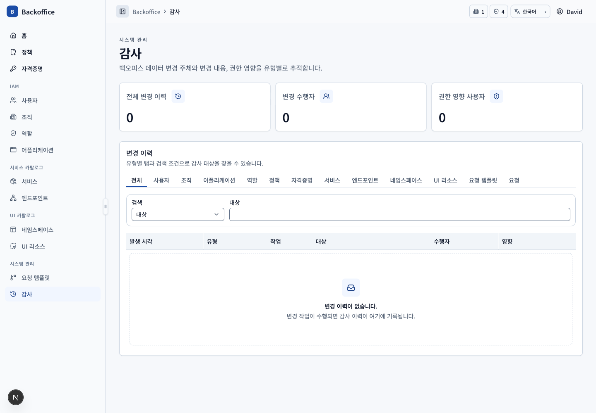
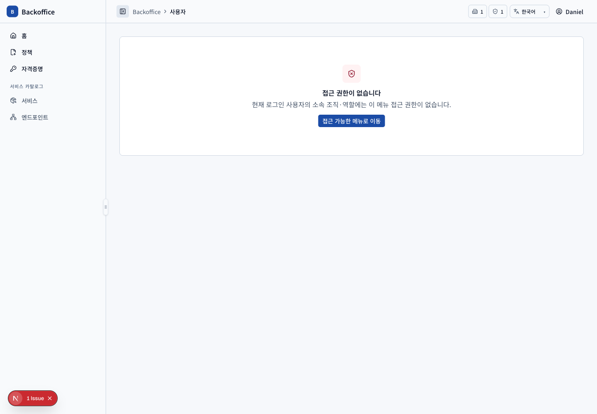

# 감사 메뉴 PRD

## 개요

- 목표: 모든 주요 엔티티와 관계 변경의 수행자·변경 전후·권한 영향을 유형별로 추적한다.
- routes: `/audit-logs`, `/audit-logs/{eventId}`
- 주 사용자: 감사 메뉴 UI 정책을 보유한 사용자
- 원본: UI `AUD-001~003`, 서버 `AUD-S001~004`

## 대표 화면

현재 기본 fixture는 감사 이벤트가 0건이므로 상세 스크린샷은 생성하지 않는다. 상세 캡처 시에는 실제 변경 command로 이벤트를 만든 뒤 반환된 event ID로 `/audit-logs/{eventId}`에 접근해야 한다.

## 사용자 시나리오

| ID         | 사용자·선행 조건               | 사용자 흐름·완료 결과                                                         | UI 요구사항          | 필요한 서버 기능                                                                                       | 화면                                         |
| ---------- | ------------------------------ | ----------------------------------------------------------------------------- | -------------------- | ------------------------------------------------------------------------------------------------------ | -------------------------------------------- |
| AUD-SCN-01 | 감사 목록 view 정책 보유       | 전체 또는 엔티티 유형 탭을 선택하고 단일 조건으로 최대 20건씩 검색한다.       | `AUD-001~002`        | UI 리소스 권한 거부, 유형별 filter·server pagination·sort·total (`AUD-S001~002`, 외부 연동 `AUD-S004`) |             |
| AUD-SCN-02 | 변경 이벤트 존재               | 발생 시각·유형·작업·대상·수행자·권한 영향 요약을 보고 행으로 상세에 진입한다. | `AUD-003`, `COM-024` | 모든 변경 transaction과 같은 경계에서 수행자·대상·전후 snapshot·권한 영향 기록 (`AUD-S002~004`)        | 캡처 조건: 변경 command 실행 후 목록         |
| AUD-SCN-03 | 감사 상세 view 권한과 event ID | 필드별 변경 전후, 권한 증감 사용자와 관련 정책을 확인한다.                    | `AUD-003`            | 존재·권한 검증, 안정 snapshot 반환, 민감 필드 제거 (`AUD-S001~003`)                                    | 캡처 조건: `/audit-logs/{eventId}`           |
| AUD-SCN-04 | 권한 미보유 사용자             | 메뉴를 보지 못하고 직접 URL·API 접근은 거부된다.                              | `AUD-001`, `COM-025` | 빈 목록 fallback 없이 route와 query 모두 403 (`AUD-S001`)                                              |  |

## 보안·운영 조건

API Key 원문, Secret value와 요청 비밀 입력은 감사 snapshot에 저장하지 않는다. 운영 서버는 인증 수행자를 client 입력이 아닌 서버 세션에서 결정하고 위변조 방지와 보존 정책을 제공해야 한다(`AUD-S003~004`).
