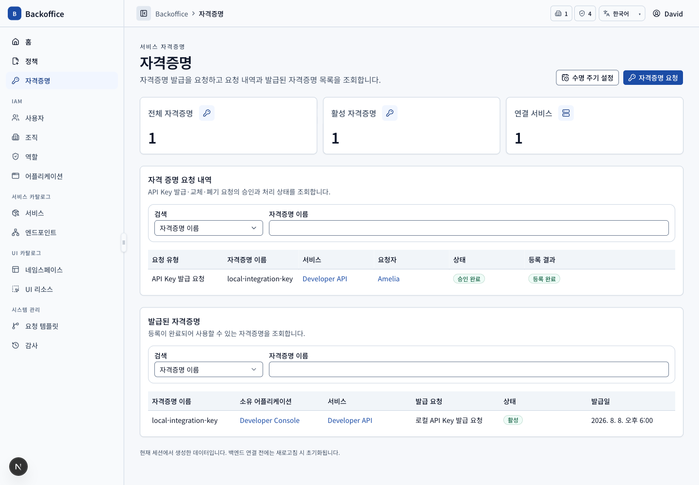
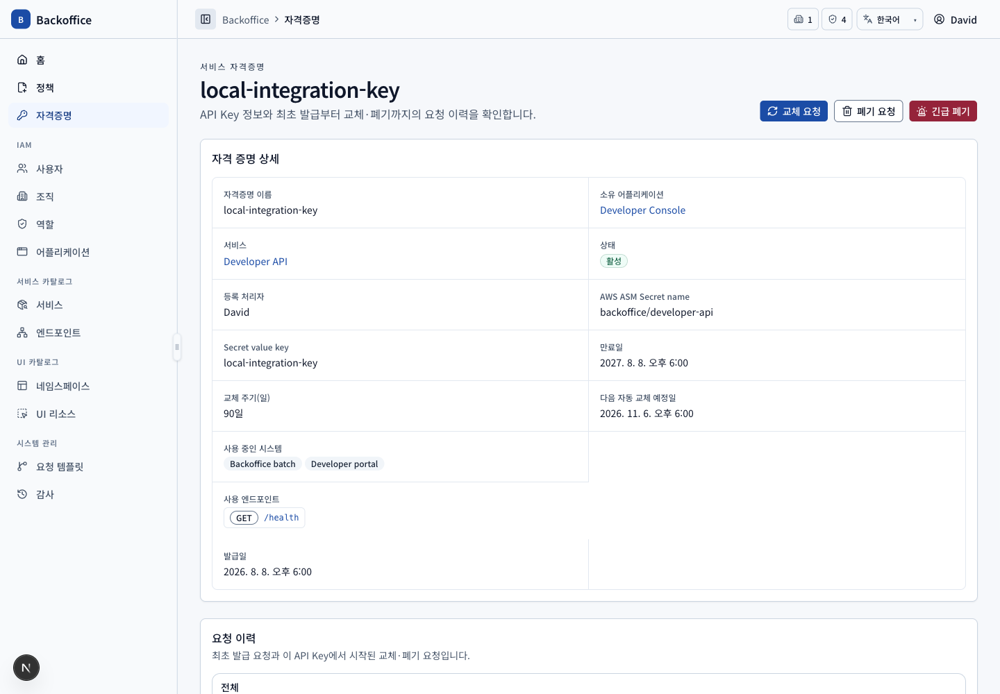
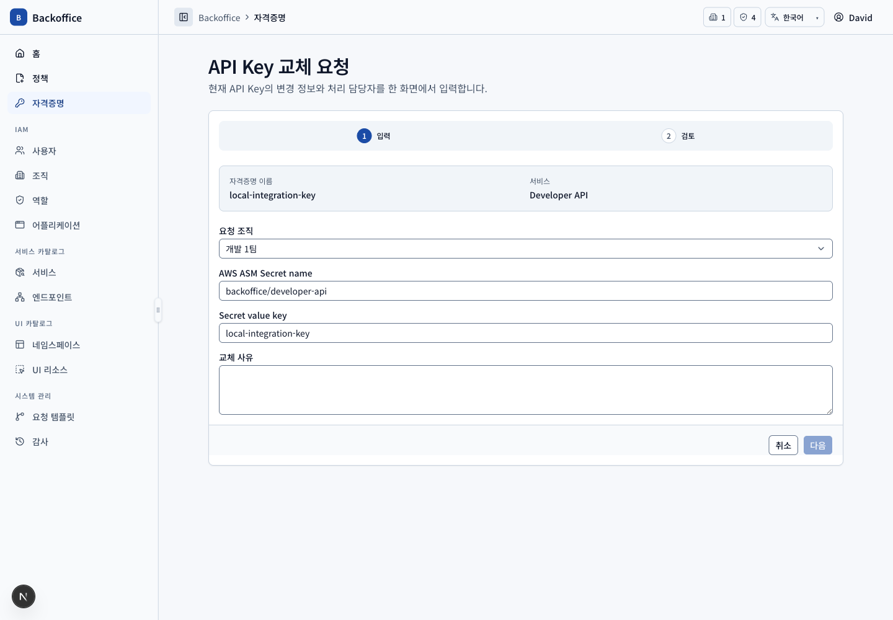
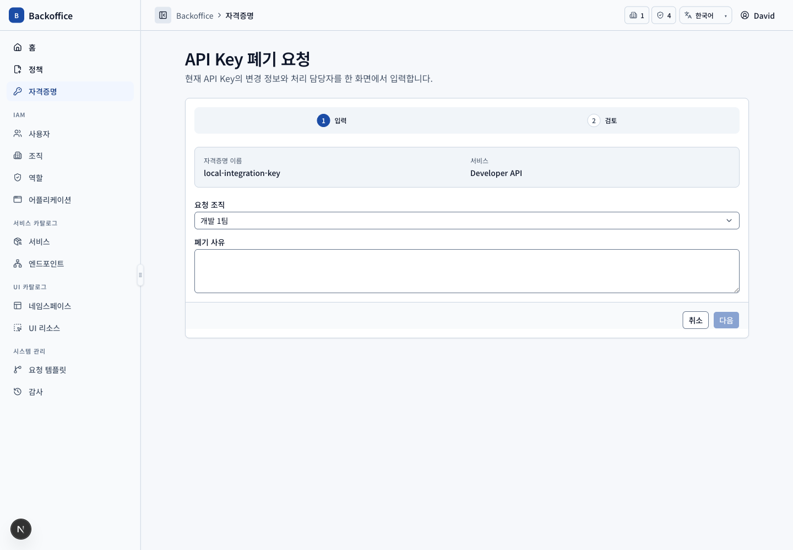
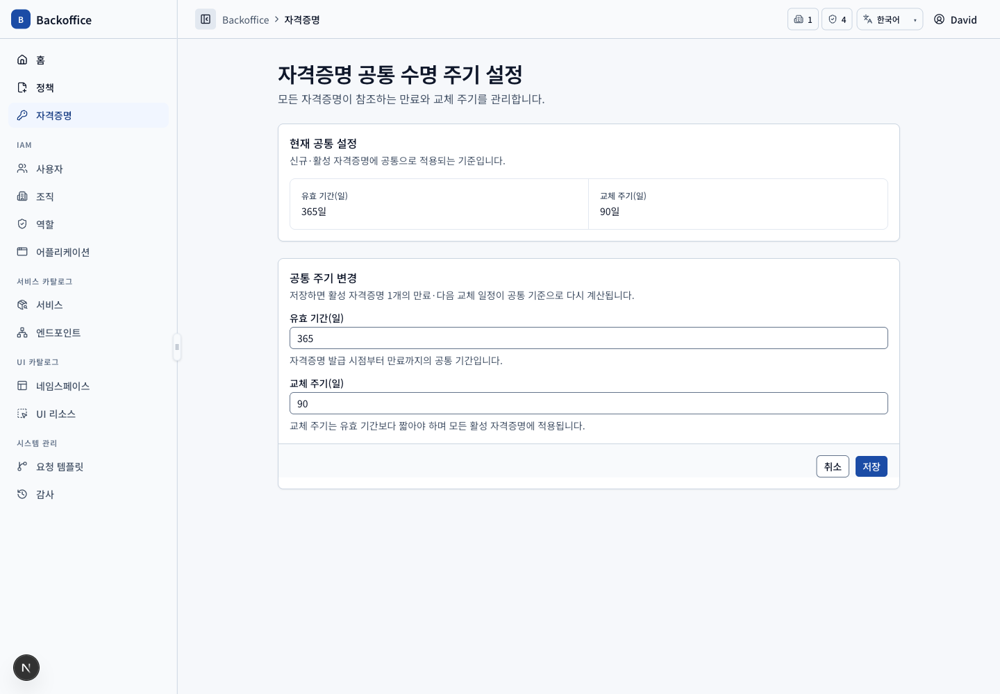
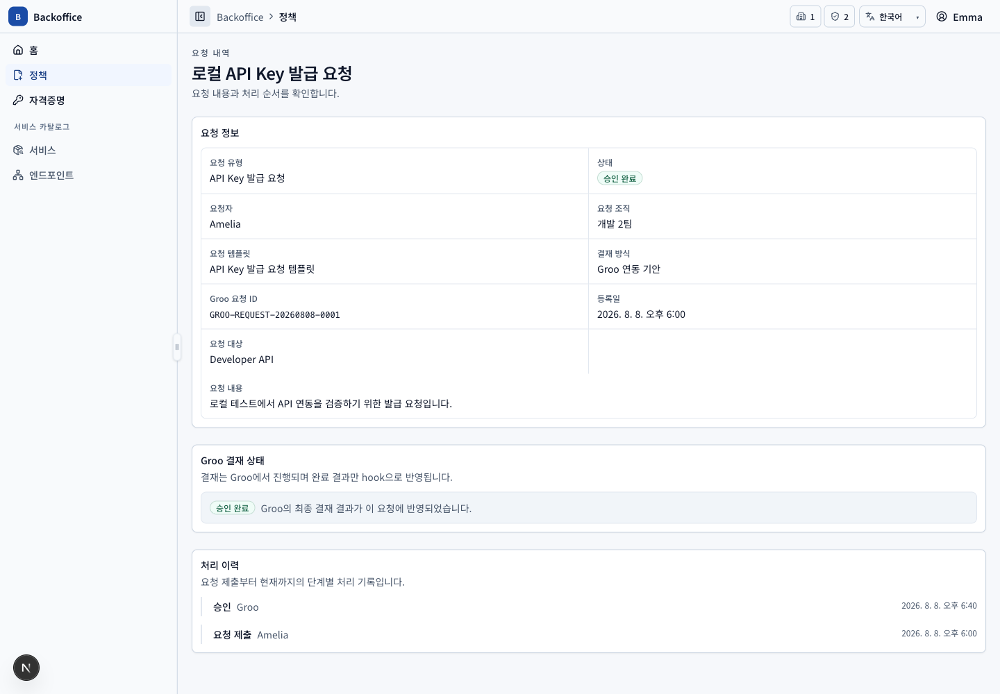

# 자격증명 메뉴 PRD

## 개요

- 목표: 어플리케이션이 서비스를 호출할 자격증명의 발급·등록·교체·폐기와 수명 주기를 안전하게 관리한다.
- routes: `/credentials`, `/credentials/request`, `/credentials/{id}`, `/replace`, `/dispose`, `/credentials/lifecycle-settings`
- 주 사용자: 모든 요청자, 서비스 소유 조직 사용자, 시스템 관리자
- 원본: UI `KEY-001~026`, 서버 `KEY-S001~014`, `TPL-S009~010`

## 대표 화면

| 목록                                          | 상세                                            |
| --------------------------------------------- | ----------------------------------------------- |
|  |  |

| 신규 발급 요청                               | 교체 요청                                    | 폐기 요청                                    |
| -------------------------------------------- | -------------------------------------------- | -------------------------------------------- |
|  |  |  |

## 사용자 시나리오

| ID         | 사용자·선행 조건                               | 사용자 흐름·완료 결과                                                                                                                                | UI 요구사항                                    | 필요한 서버 기능                                                                                                                   | 화면                                                                             |
| ---------- | ---------------------------------------------- | ---------------------------------------------------------------------------------------------------------------------------------------------------- | ---------------------------------------------- | ---------------------------------------------------------------------------------------------------------------------------------- | -------------------------------------------------------------------------------- |
| KEY-SCN-01 | 자격증명 목록 view 권한                        | 본인 요청·소유 어플리케이션 조직·대상 서비스 관계로 조회 가능한 자격증명과 요청을 검색한다. 원문·식별값·상태 토글은 보지 않는다.                     | `KEY-004`, `KEY-008~010`, `KEY-014`            | 관계 기반 범위, 서버 pagination·filter·total, 비밀 원문 미반환 (`KEY-S001`, `KEY-S006`)                                            |                                              |
| KEY-SCN-02 | 활성 Groo 발급 템플릿과 소유 어플리케이션 존재 | 어플리케이션·서비스를 선택하고 내부 서비스 엔드포인트를 복수 선택한 뒤 이름·ASM 위치·사유를 입력한다. 검토에서 Groo 위임을 확인하고 제출한다.        | `KEY-001~003`, `KEY-013`, `KEY-020`, `KEY-025` | 요청자·소유 조직·중복 자격증명·서비스·엔드포인트 검증 후 Groo 기안 생성과 고유 요청 ID 원자적 저장 (`KEY-S002`, `TPL-S009~010`)    |                                      |
| KEY-SCN-03 | 제출된 Groo 발급 요청                          | 요청 상세에서 Groo 요청 ID와 승인 대기 상태를 확인한다. 내부 승인 버튼은 없고 완료 hook 이후 등록 대기 또는 반려로 변경된다.                         | `APL-020`, `KEY-004`, `KEY-025`                | hook 인증·재전송 방지·고유 ID 매핑·멱등 상태 전이와 outbox (`KEY-S003`, `KEY-S013`)                                                |                               |
| KEY-SCN-04 | 승인 완료·등록 대기 요청, 등록 권한            | 내부 서비스는 시스템 API 등록 결과를 일회성으로 확인하고 외부 서비스는 소유 조직이 원문을 수동 입력한다.                                             | `KEY-004`, `KEY-007`                           | 정확히 한 번 등록 transaction, 내부 API/외부 입력을 ASM에 저장하고 원문 비영속 (`KEY-S003~005`)                                    |                                    |
| KEY-SCN-05 | 등록된 내부 서비스 자격증명                    | 기본 정보·엔드포인트·발급부터 후속 요청 이력과 자동 생성된 시스템 정책을 조회한다.                                                                   | `KEY-016`, `KEY-024`                           | 자격증명·요청 이력·시스템 정책 관계 query (`KEY-S001`, `KEY-S007`, `KEY-S012`)                                                     |                                            |
| KEY-SCN-06 | 활성 자격증명                                  | 상세에서 교체 또는 폐기를 시작해 고정 대상과 3단계 결재선을 검토한 뒤 제출한다.                                                                      | `KEY-015`                                      | 활성 자격증명·유형별 템플릿 검증, 교체 시 기존 키 비활성/정책 유지, 폐기 시 정책 비활성 (`KEY-S007`, `TPL-S006~007`)               | ,  |
| KEY-SCN-07 | 수명 주기 설정 action 권한                     | 공통 만료·교체 정책을 설정하고 모든 자격증명이 참조할 기준을 확인한다. 상세에서는 다음 자동 교체일과 사용 시스템을 관리한다.                         | `KEY-021~022`                                  | 날짜·1~365일 주기·사용 시스템 중복 검증과 예약 교체 작업 (`KEY-S009`, 외부 연동 `KEY-S010`)                                        |                           |
| KEY-SCN-08 | 시스템 관리자 또는 서비스 소유 조직 관리 권한  | 활성 자격증명을 사유와 함께 긴급 폐기하고 정책·예약을 비활성화한다.                                                                                  | `KEY-023`                                      | 업무 관계와 UI action 이중 검증, 원자적 폐기·예약 제거·요청자 알림 (`KEY-S011`, 외부 감사 `KEY-S008`)                              |                                     |
| KEY-SCN-09 | 승인 완료·등록 대기 요청, 등록 권한            | 등록 실패 상태와 시도별 처리자·오류·시각을 확인하고 원인을 조치한 뒤 명시적으로 재시도한다. 성공하면 시도 이력을 유지한 채 자격증명 상세로 이어진다. | `KEY-026`                                      | 실패 시도만 원자적으로 기록하고 부분 자격증명·정책 생성을 금지하며, 권한·상태 재검증과 단조 증가 순번으로 멱등 재시도 (`KEY-S014`) |                                |
| KEY-SCN-10 | 소유 어플리케이션 상세 view 권한               | 어플리케이션 상세의 자격증명 생성 버튼으로 진입해 어플리케이션과 요청 조직이 사전 선택된 상태에서 나머지 발급 요청을 작성한다.                       | `APP-103`, `KEY-002~003`                       | URL 식별자 검증과 요청자 소속 조직·어플리케이션 소유 조직 일치 검증 (`KEY-S002`)                                                   |                                      |

## 보안 불변 조건

API Key 원문은 일반 엔티티, 응답 재조회, 로그, 감사 snapshot과 PRD 스크린샷에 남기지 않는다. 외부 저장 실패 시 자격증명·시스템 정책·부여 관계를 부분 생성하지 않고 비밀이 없는 실패 코드만 등록 시도 이력에 남긴다.
