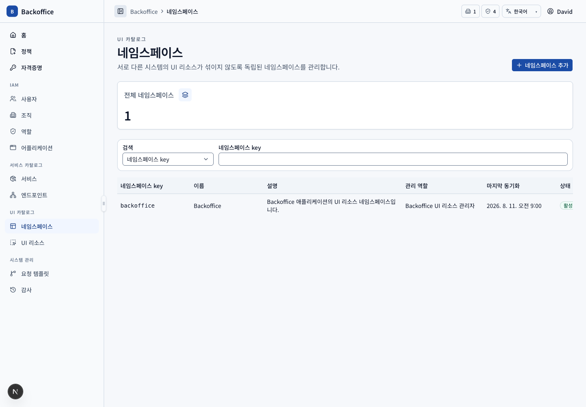
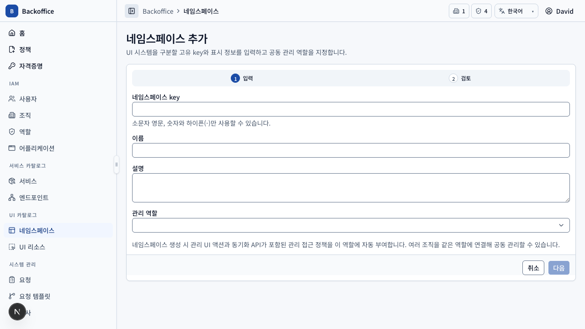
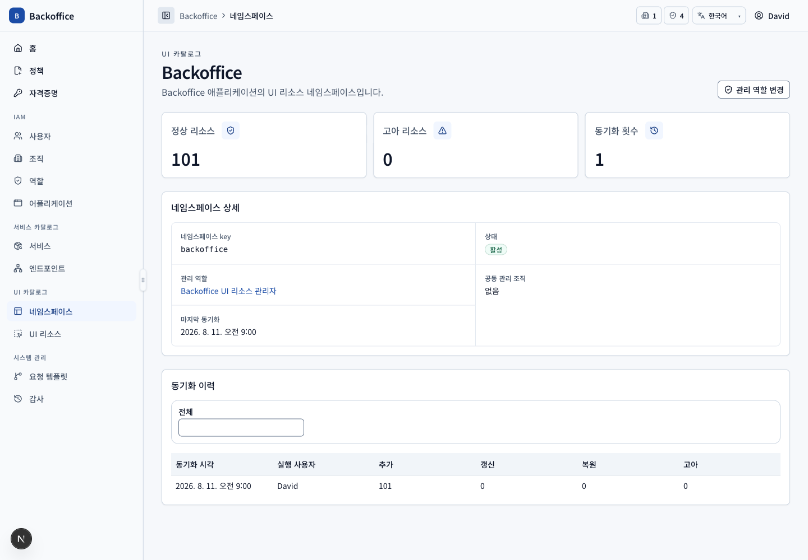

# 네임스페이스 메뉴 PRD

## 개요

- 목표: 여러 UI 시스템의 리소스를 격리하고 공동 관리 역할과 동기화 범위를 지정한다.
- routes: `/namespaces`, `/namespaces/new`, `/namespaces/{namespaceId}`, `/namespaces/{namespaceId}/edit`
- 주 사용자: UI 리소스 관리자, 시스템 관리자
- 원본: UI `UIR-001`, `UIR-018`, `UIR-020`, 서버 `UIR-S001`, `UIR-S005`, `UIR-S008~009`

## 대표 화면

| 생성                                                           | 상세                                               |
| -------------------------------------------------------------- | -------------------------------------------------- |
|  |  |

## 사용자 시나리오

| ID         | 사용자·선행 조건                  | 사용자 흐름·완료 결과                                                                       | UI 요구사항                     | 필요한 서버 기능                                                                                                     | 화면                                            |
| ---------- | --------------------------------- | ------------------------------------------------------------------------------------------- | ------------------------------- | -------------------------------------------------------------------------------------------------------------------- | ----------------------------------------------- |
| NSP-SCN-01 | 일반 사용자 역할                  | key·이름·관리 역할·상태·동기화 시각으로 조회하고 행으로 상세에 진입한다.                    | `UIR-001`, `UIR-020`            | namespace filter·pagination·정상/고아·동기화 통계 (`UIR-S001`, `UIR-S005`, `UIR-S008`)                               |              |
| NSP-SCN-02 | 생성 action·create view 권한      | kebab-case key·이름·설명·관리 역할을 입력하고 검토한 뒤 생성해 상세로 이동한다.             | `UIR-018`, `COM-005`, `COM-026` | key·이름 고유성, 역할 존재, 관리 UI action+동기화 API 정책 생성과 역할 부여 transaction (`UIR-S001`, `UIR-S005~006`) |       |
| NSP-SCN-03 | 일반 사용자 역할                  | 관리 역할과 역할 부여 조직, 정상·고아 리소스 수, 마지막 동기화와 이력을 조회한다.           | `UIR-020`, `UIR-021`            | namespace·관리 역할·독립 sync history query와 스냅샷 통계 (`UIR-S008~009`)                                           |            |
| NSP-SCN-04 | 관리 역할 변경 action 권한        | 새 역할을 검색·선택하고 기존 관리 정책을 새 역할로 원자적으로 이동한다.                     | `UIR-020`                       | 대상 역할·기존 정책 부여 검증과 동시 회수/부여 (`UIR-S008`)                                                          |  |
| NSP-SCN-05 | 일반 namespace와 폐기 action 권한 | 하위 리소스 영향 확인 후 namespace를 폐기한다. Backoffice 기본 namespace는 폐기하지 못한다. | `UIR-020`                       | 기본 namespace 보호, 하위 UI 리소스 일괄 비활성화와 감사 (`UIR-S008`, `AUD-S002~004`)                                |     |

## 모델 경계

네임스페이스는 UI 리소스의 탐색·동기화 범위이며 정책 리소스나 일반 권한 부여 대상이 아니다. 관리 권한은 관리 역할과 그 역할에 부여된 관리 정책으로 판정한다. 전체 UI 리소스 수 집계 카드는 MVP 이후 범위다(`UIR-020-P1`).
