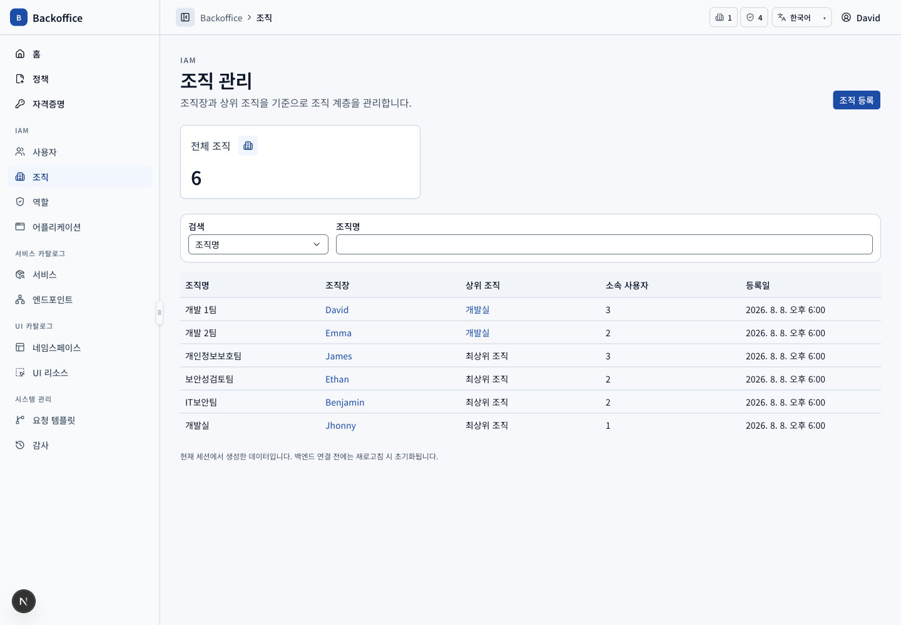
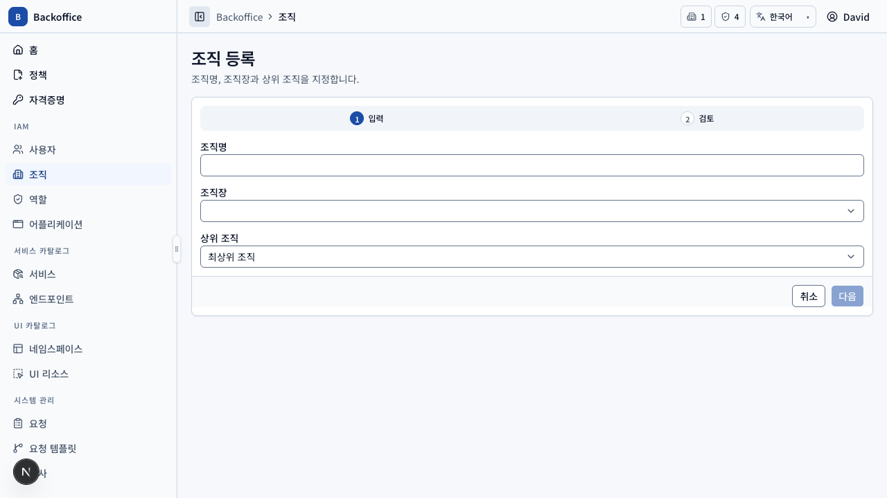
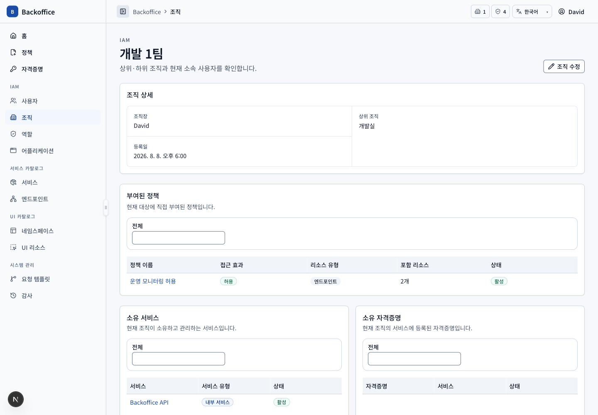

# 조직 메뉴 PRD

## 개요

- 목표: 모든 사용자가 계층 조직 정보를 조회하고 IAM 권한 보유자가 사용자·역할·정책 및 소유 리소스 관계를 운영한다.
- routes: `/organizations`, `/organizations/new`, `/organizations/{organizationId}`, `/organizations/{organizationId}/edit`
- 주 사용자: 모든 재직·휴직 사용자, IAM 운영자, 시스템 관리자
- 원본: UI `ORG-001~109`, 서버 `ORG-S001~005`, `IAM-S001~003`

## 대표 화면

| 등록                                                      | 상세                                          |
| --------------------------------------------------------- | --------------------------------------------- |
|  |  |

## 사용자 시나리오

| ID         | 사용자·선행 조건                  | 사용자 흐름·완료 결과                                                                                      | UI 요구사항                             | 필요한 서버 기능                                                                                                            | 화면                                                 |
| ---------- | --------------------------------- | ---------------------------------------------------------------------------------------------------------- | --------------------------------------- | --------------------------------------------------------------------------------------------------------------------------- | ---------------------------------------------------- |
| ORG-SCN-01 | 모든 재직·휴직 사용자             | 조직명·조직장·상위 조직으로 검색하고 계층 정보를 조회한다.                                                 | `ORG-001~003`                           | 서버 pagination·filter, 조직장·상위 조직 표시 DTO (`ORG-S001~002`)                                                          |                |
| ORG-SCN-02 | 조직 생성 action·create view 권한 | 조직명, 조직장과 선택적 상위 조직을 입력하고 검토한 뒤 등록해 상세로 이동한다.                             | `ORG-004`, `COM-005`, `COM-026`         | 이름 중복, 재직 조직장, 상위 조직 존재·순환·최소 소속 검증 (`ORG-S001`, `IAM-S001~002`)                                     |         |
| ORG-SCN-03 | 상세 view 권한                    | 조직장·상위/하위 조직, 사용자, 역할, 직접 정책, 소유 서비스·자격증명을 독립 목록으로 조회한다.             | `ORG-101`, `ORG-103~108`, `COM-030`     | 관계별 독립 query와 total, 연결 대상 상세 식별자 (`ORG-S005`, `IAM-S001~003`, `POL-S005`, `KEY-S006`)                       |              |
| ORG-SCN-04 | 조직 수정 action·update view 권한 | 이름·조직장·상위 조직을 입력하고 검토한 뒤 저장해 상세로 돌아온다.                                         | `ORG-102`, `COM-026`                    | 권한, 조직장 유효성, 순환 계층, 소유 서비스·진행 요청 영향 검증 (`ORG-S003`, `IAM-S002`)                                    |              |
| ORG-SCN-05 | 사용자·역할 연결 action 권한      | 미소속 사용자 또는 미부여 역할을 검색·복수 추가하고 행 단위로 제거한다.                                    | `ORG-104~105`, `COM-013~014`            | 후보 query, 중복 방지, 마지막 소속·조직장·진행 요청 보호와 transaction (`ORG-S003`, `USR-S003~004`, `IAM-S001`, `IAM-S003`) |         |
| ORG-SCN-06 | 사용자 관계 제거 시 영향 존재     | 확인 화면에서 감소 역할·정책·자격증명 조회 범위와 담당자 누락 요청을 검토하고 보호 관계면 확정을 차단한다. | `ORG-109`                               | 최신 관계 기준 impact preview와 command 재검증 (`USR-S003~004`, `USR-S006`)                                                 |  |
| ORG-SCN-07 | 일반 사용자 기본 정책만 보유      | 조직 목록·상세는 조회하지만 등록·수정과 사용자·역할 관계 관리 기능은 보지 않는다.                          | `ORG-001~004`, `ORG-102~105`, `COM-029` | query는 허용하고 각 관리 command는 UI·API에서 동일하게 권한을 거부 (`ORG-S002~003`, `COM-S003`)                             |              |

## 제외 범위

조직장·사용자 집계, 조직 관계 변경 전용 집계와 고정 조직 결재 템플릿 역조회는 MVP 화면에서 제외한다(`ORG-106`, `ORG-110`).
