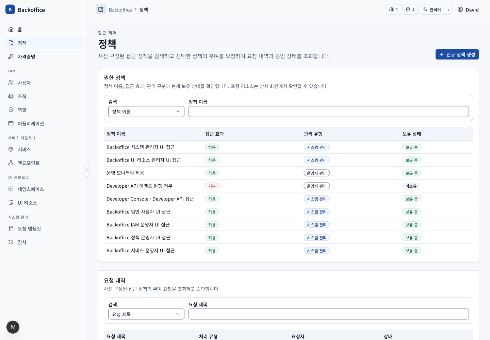
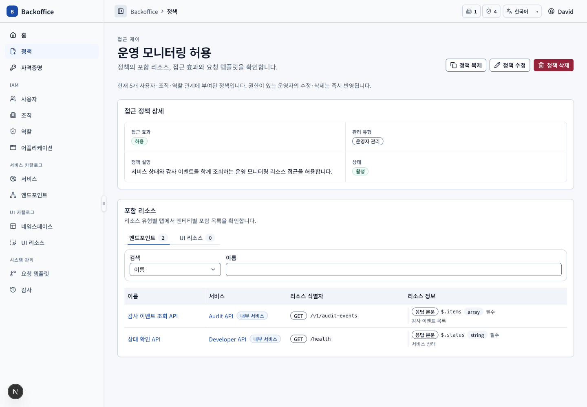
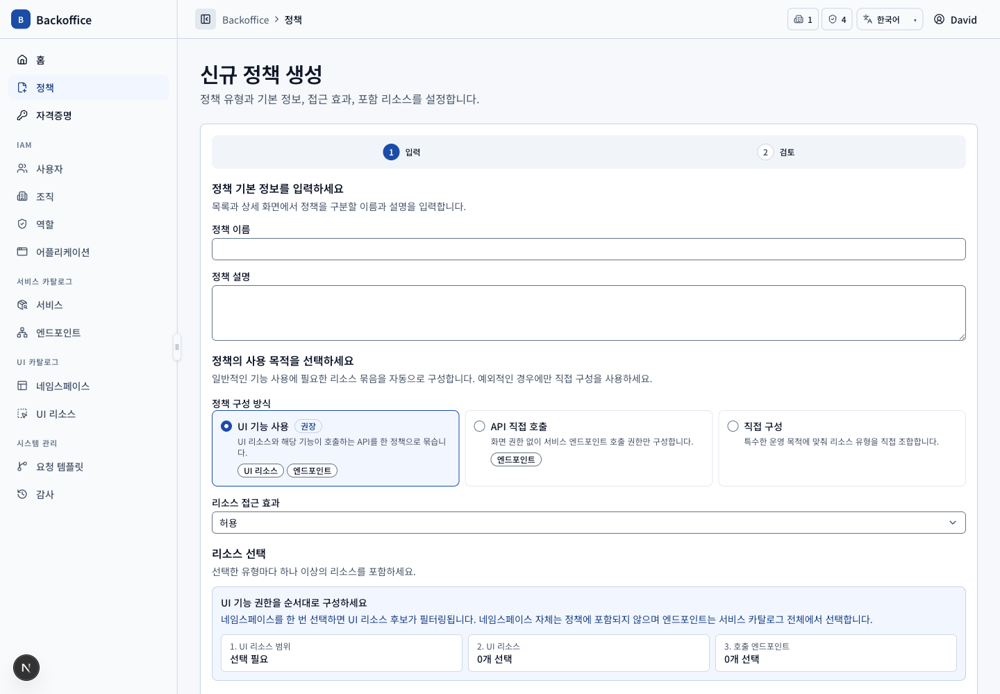
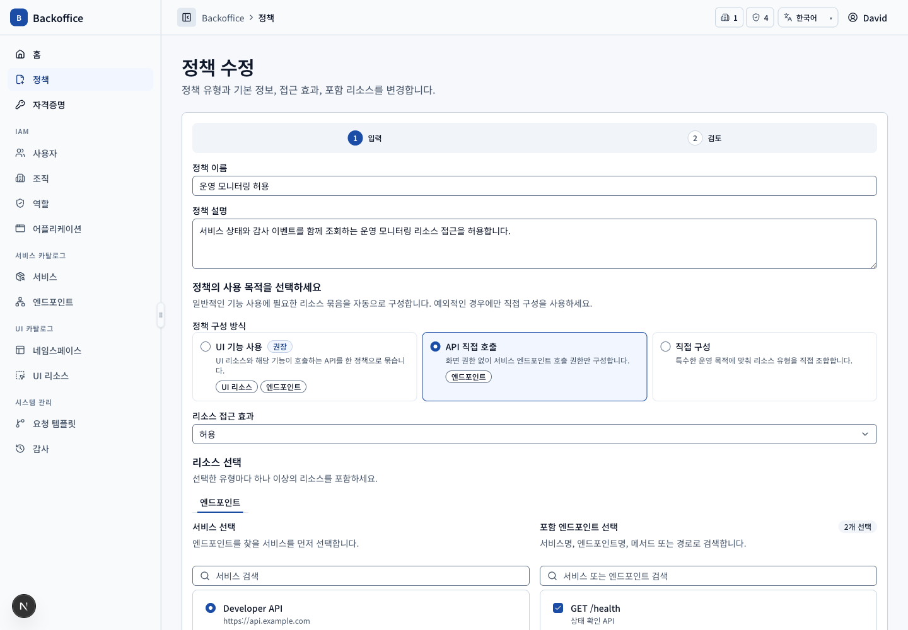
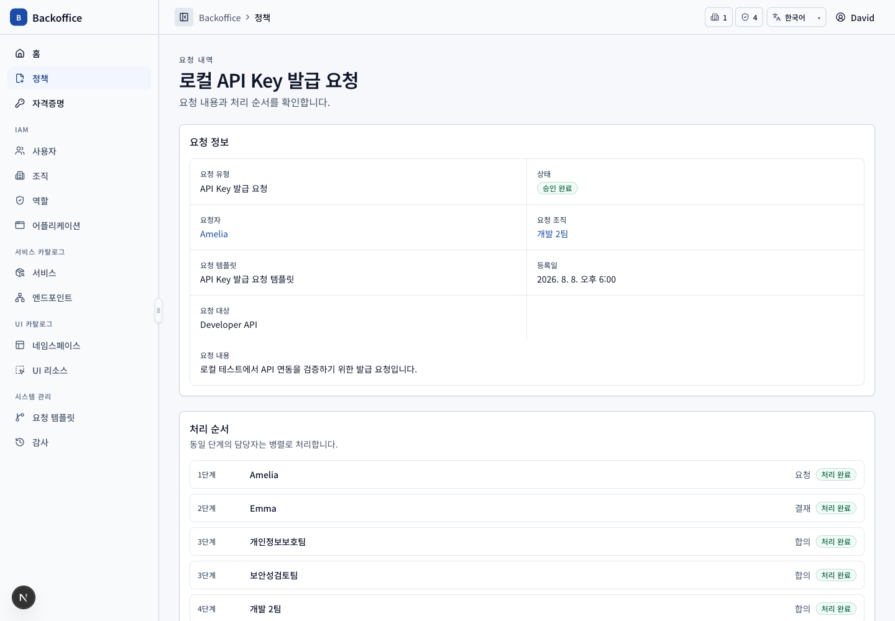

# 정책 메뉴 PRD

## 개요

- 목표: 접근 리소스 묶음을 탐색·구성하고 사용자별 만료가 있는 정책 부여 요청과 처리 이력을 관리한다.
- routes: `/approval-documents`, `/approval-documents/new`, `/approval-documents/{policyId}`, `/edit`, `/request`, `/approval-documents/requests/{requestId}`
- 주 사용자: 모든 사용자, 정책 운영자, 시스템 관리자, 요청 처리 담당자
- 원본: UI `PRQ-001~032`, 서버 `POL-S001~019`, `TPL-S007`

## 대표 화면

| 목록                                   | 상세                                     |
| -------------------------------------- | ---------------------------------------- |
|  |  |

| 생성 입력                                | 수정·영향 검토                           |
| ---------------------------------------- | ---------------------------------------- |
|  |  |

| 부여 요청                                      | 요청 상세                                             |
| ---------------------------------------------- | ----------------------------------------------------- |
|  |  |

## 사용자 시나리오

| ID         | 사용자·선행 조건             | 사용자 흐름·완료 결과                                                                                             | UI 요구사항                                        | 필요한 서버 기능                                                                                                                                     | 화면                                             |
| ---------- | ---------------------------- | ----------------------------------------------------------------------------------------------------------------- | -------------------------------------------------- | ---------------------------------------------------------------------------------------------------------------------------------------------------- | ------------------------------------------------ |
| POL-SCN-01 | 모든 사용자                  | 활성 정책을 검색하고 효과·일반/시스템 정책 분류·보유 상태를 확인해 행으로 상세에 진입한다.                        | `PRQ-001~003`, `PRQ-012`, `PRQ-023~024`, `PRQ-032` | 범위 제한 없는 활성 카탈로그, 사용자 실효 보유·누락 리소스 계산, 시스템 정책 구분 (`POL-S001`, `POL-S005`, `POL-S007`, `POL-S018`)                   |                 |
| POL-SCN-02 | 정책 상세 view 권한          | 기본 정보와 엔드포인트·UI 리소스를 유형별 독립 탭, 검색과 20건 페이지로 조회한다.                                 | `PRQ-013~014`, `COM-030`                           | 유형별 전용 DTO·total query, 서비스·필드 상세 조합 (`POL-S001`, `POL-S017`, `EPT-S001`)                                                              |               |
| POL-SCN-03 | 정책 생성 action 권한        | 메타 정보·목적·효과를 입력하고 네임스페이스→UI 리소스, 서비스→엔드포인트 순서로 복수 선택한 뒤 검토·생성한다.     | `PRQ-015`, `PRQ-019~022`, `PRQ-025`                | 활성 요청 템플릿 단일 결정, 리소스 존재·중복·단일 UI 네임스페이스 검증과 transaction (`POL-S001~003`, `POL-S006`)                                    |               |
| POL-SCN-04 | 일반 정책과 수정 action 권한 | 기존 값을 편집하고 변경 항목·리소스 증감·실제 접근 가능/불가 리소스와 영향 사용자를 검토한 뒤 즉시 저장한다.      | `PRQ-026`, `PRQ-028`                               | 다른 활성 정책의 allow/deny까지 계산한 impact preview, 저장 후 고유 사용자 비동기 알림 snapshot (`POL-S005`, `POL-S008~009`, `POL-S013`, `POL-S019`) |               |
| POL-SCN-05 | 복제 가능한 일반 정책        | 상세에서 복제를 선택해 값이 채워진 신규 생성 페이지로 이동하고 수정 후 일반 생성 endpoint로 저장한다.             | `PRQ-027`                                          | 즉시 복제 command 없이 부여 관계를 제외한 원본 조회와 일반 생성 (`POL-S014`)                                                                         |        |
| POL-SCN-06 | 미보유 또는 일부 보유 정책   | 상세의 요청하기로 이동해 고정 정책, 요청 조직, 사유와 사용자별 만료를 입력하고 검토에서 결재선을 조정해 제출한다. | `PRQ-003~006`, `PRQ-008`, `PRQ-010~011`, `PRQ-024` | 요청자·조직·미래 만료·사유·누락 리소스·결재선 snapshot 검증, draft와 submitted 상태 (`POL-S004~005`, `POL-S012`, `POL-S015`, `TPL-S007`)             |         |
| POL-SCN-07 | 현재 담당자 또는 요청자      | 요청 상세에서 현재 병렬 단계와 이력을 보고 승인·합의·참조·반려를 처리하거나 요청자가 회수·재상신한다.             | `PRQ-007`, `PRQ-009~010`                           | 현재 담당자만 가능한 멱등 상태 전이, 병렬 단계 활성화, 처리 이력과 승인 시 정책 부여 transaction (`POL-S004`, `POL-S011~012`)                        |  |
| POL-SCN-08 | 삭제 action 권한             | 일반 정책을 삭제하고 부여 중이면 즉시 실효 권한에서 제외되는 영향을 확인한다. 시스템 정책은 삭제하지 못한다.      | `PRQ-023`, `PRQ-026`, `PRQ-032`                    | 권한 검증, 부여 중 정책 비활성화와 감사·알림, 시스템 정책 대상 거부 (`POL-S006`, `POL-S008~010`, `POL-S018`)                                         |        |

## 제외 범위

정책 충돌 분석과 권한 시뮬레이션은 MVP 이후 범위다(`PRQ-029`, `POL-S016`).
