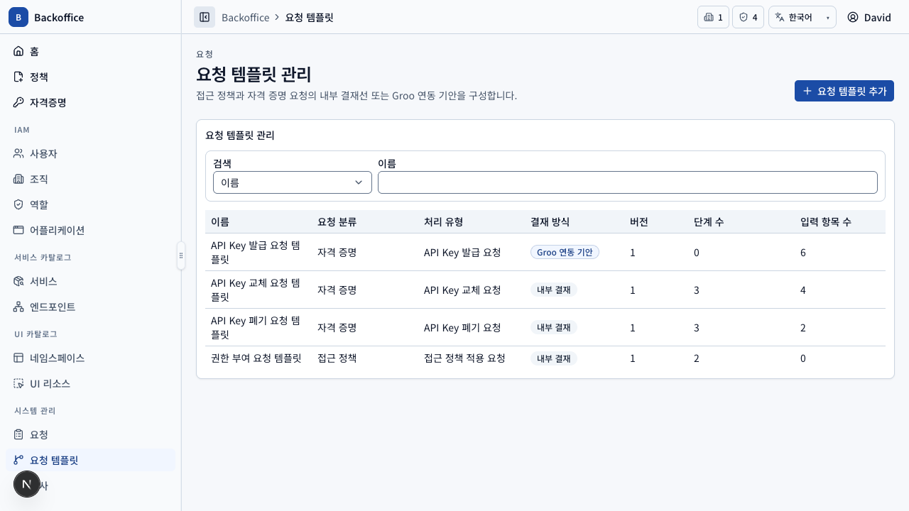
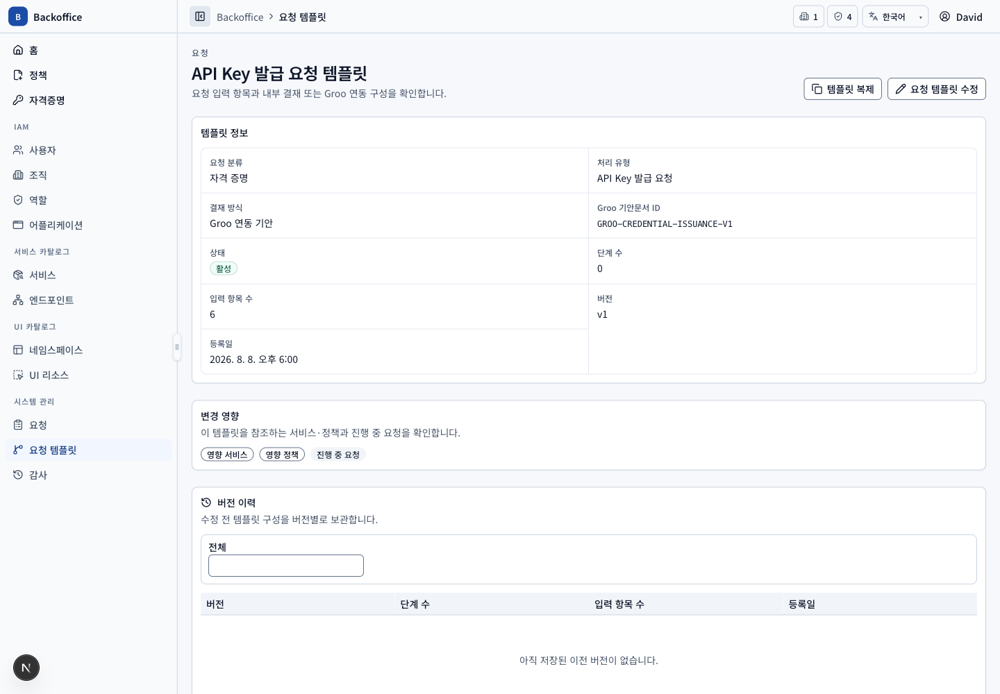
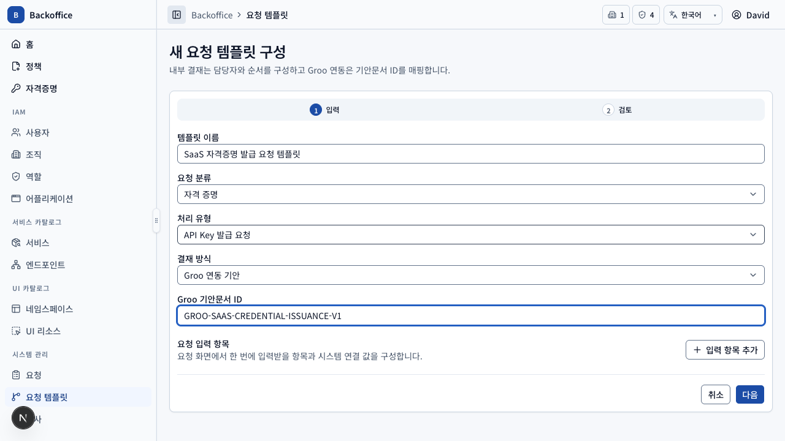
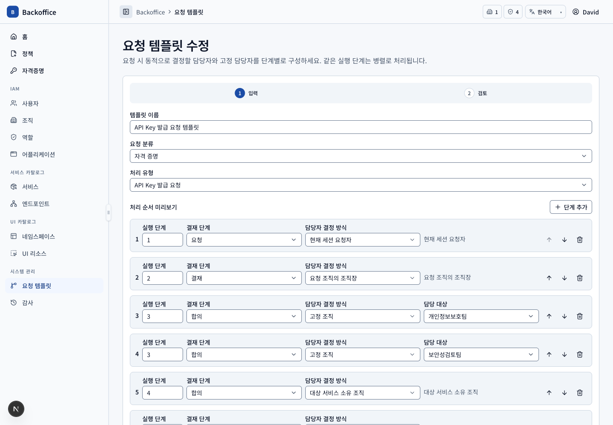
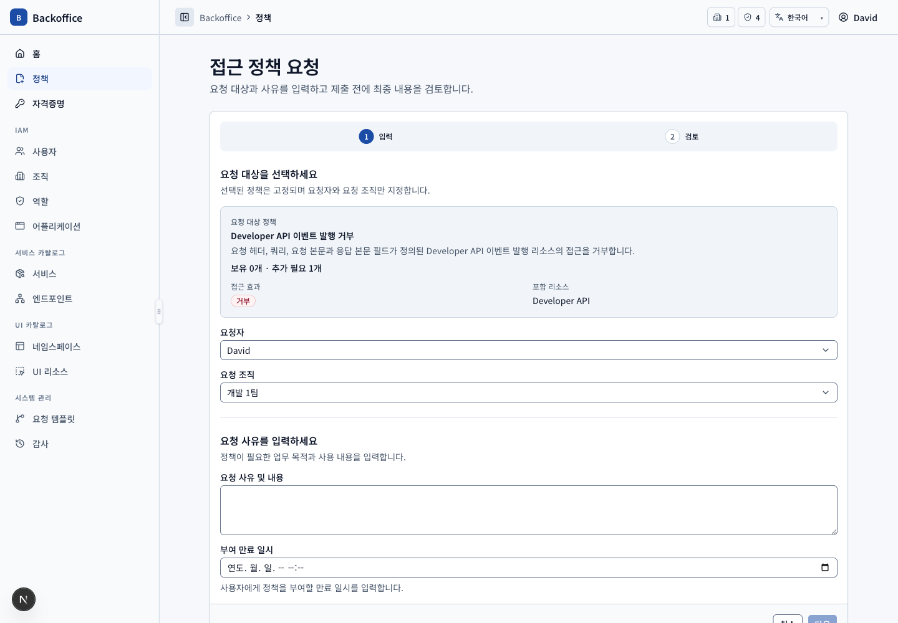
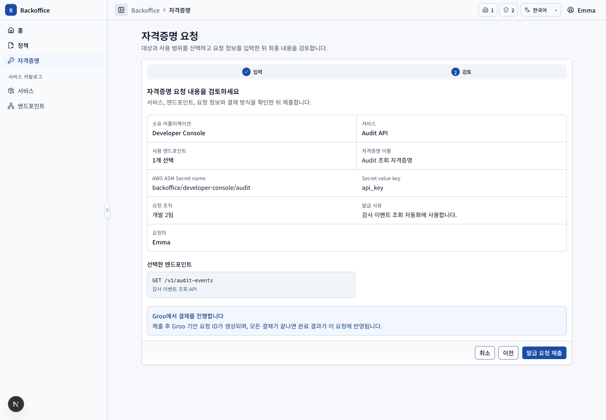

# 결재 템플릿 메뉴 PRD

## 개요

- 목표: 접근 정책·자격증명 요청별 입력 항목과 내부 결재선 또는 Groo 연동 기안 구성을 버전으로 관리한다.
- routes: `/approval-lines`, `/approval-lines/new`, `/approval-lines/{id}`, `/approval-lines/{id}/edit`
- 주 사용자: 시스템 관리자와 결재 템플릿 UI 정책을 부여받은 운영자
- 원본: UI `APL-001~020`, 서버 `TPL-S001~010`

## 대표 화면

| 목록                                                   | 상세                                                     |
| ------------------------------------------------------ | -------------------------------------------------------- |
|  |  |

| 생성                                                     | 수정                                                     |
| -------------------------------------------------------- | -------------------------------------------------------- |
|  |  |

## 사용자 시나리오

| ID         | 사용자·선행 조건               | 사용자 흐름·완료 결과                                                                                                                                | UI 요구사항                                    | 필요한 서버 기능                                                                                                                     | 화면                                                                                        |
| ---------- | ------------------------------ | ---------------------------------------------------------------------------------------------------------------------------------------------------- | ---------------------------------------------- | ------------------------------------------------------------------------------------------------------------------------------------ | ------------------------------------------------------------------------------------------- |
| TPL-SCN-01 | 목록 view 권한                 | 이름·분류·처리 유형·결재 방식·단계/필드 수·상태로 조회한다. 권한이 있으면 활성 Switch를 변경한다.                                                    | `APL-008~009`, `APL-013`                       | 템플릿 filter·pagination·total, 새 요청에서 비활성 제외 (`TPL-S001`)                                                                 |                                                   |
| TPL-SCN-02 | 생성 view/action 권한          | 분류·처리 유형·기본 정보와 결재 방식을 선택한다. 내부 결재는 처리 단계를, Groo 연동은 기안문서 ID를 구성하고 입력 항목을 검토 후 저장한다.           | `APL-001~003`, `APL-006`, `APL-014`, `APL-020` | 고유 이름, 분류-처리 유형, 결재 방식별 단계 또는 Groo 문서 ID, field key·binding validation (`TPL-S001~003`, `TPL-S005`, `TPL-S009`) |                                                 |
| TPL-SCN-03 | 상세 view 권한                 | 결재 방식과 필드 구성을 조회한다. 내부 결재는 단계·병렬·담당 방식을, Groo 연동은 기안문서 ID를 확인하고 생성 요청과 버전 이력도 본다.                | `APL-012`, `APL-015`, `APL-018`, `APL-020`     | 템플릿 구성, 관련 요청 상태, revision snapshot query (`TPL-S001~003`, `TPL-S008~010`, `POL-S011`)                                    |                                                 |
| TPL-SCN-04 | 내부 결재·미리보기 action 권한 | 요청자·요청 조직·대상 서비스를 선택해 현재 데이터로 해석된 실제 담당자와 병렬 순서를 확인한다. Groo 연동에서는 내부 결재 미리보기를 제공하지 않는다. | `APL-019~020`                                  | 재직 사용자·유효 조직·상위 조직장·서비스 소유 조직 동적 해석 (`TPL-S004`, `TPL-S006`, `TPL-S008~009`)                                |                                        |
| TPL-SCN-05 | 수정 view/action 권한          | 기존 구성을 수정하고 서비스·정책·진행 요청 영향을 검토한 뒤 저장해 상세로 이동한다.                                                                  | `APL-013`, `APL-018`                           | 기존 전체 revision 저장, 버전 증가, 참조·진행 요청 영향 query와 원자적 update (`TPL-S008`)                                           |                                                 |
| TPL-SCN-06 | 복제 action 권한               | 상세의 구성으로 새 템플릿 생성 화면을 열고 값을 수정한 뒤 새 ID·1버전으로 생성한다.                                                                  | `APL-017`                                      | 입력·단계 복제 후 일반 생성 validation, 원본 관계 비복제 (`TPL-S008`)                                                                |                                                 |
| TPL-SCN-07 | 요청자                         | 내부 결재 요청은 요청 검토에서 후속 단계·담당자·병렬 여부를 수정한다. Groo 연동 요청은 위임 안내만 확인하고 제출한다.                                | `APL-016`, `APL-020`                           | 내부 결재선 snapshot 검증 또는 Groo 기안 생성·고유 요청 ID 저장 (`TPL-S007`, `TPL-S009~010`)                                         | ,  |

## 결재선 불변 조건

내부 결재에서 같은 실행 단계 번호는 병렬이다. 최초 요청자 단계는 제거·수정할 수 없고, 후속 단계에 승인 또는 합의가 하나 이상 있어야 한다. Groo 연동은 내부 단계를 함께 저장하지 않으며 기안문서 ID만 템플릿에 매핑한다.
