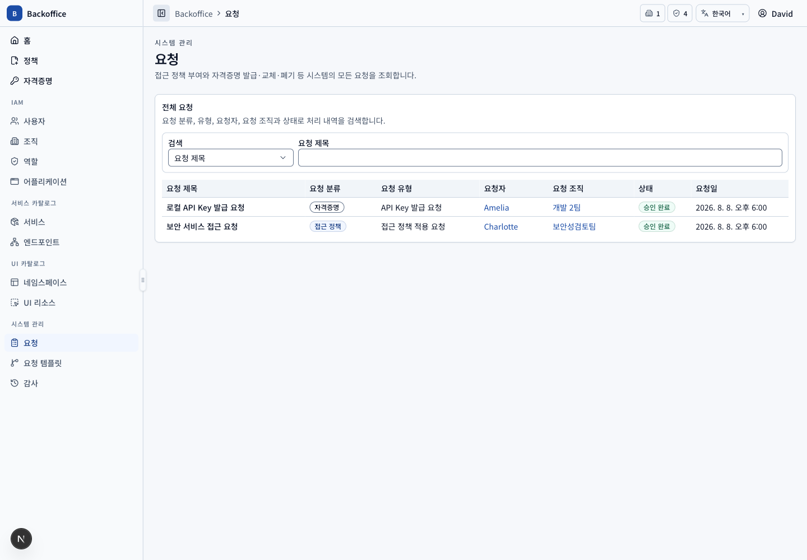

# 요청 메뉴 PRD

## 개요

- 목표: 시스템의 접근 정책 부여와 자격증명 수명 주기 요청 전체를 한 목록에서 조회한다.
- routes: `/requests`, 공통 요청 상세 `/approval-documents/requests/{requestId}`
- 주 사용자: 요청 목록 UI 리소스 정책을 보유한 시스템 운영자
- 원본: UI `REQ-001~003`, 서버 `REQ-S001~003`, 공통 요청 처리 `POL-S011`

## 대표 화면

## 사용자 시나리오

| ID         | 사용자·선행 조건                       | 사용자 흐름·완료 결과                                                                                                                                 | UI 요구사항                         | 필요한 서버 기능                                                                                                                       | 화면                                                     |
| ---------- | -------------------------------------- | ----------------------------------------------------------------------------------------------------------------------------------------------------- | ----------------------------------- | -------------------------------------------------------------------------------------------------------------------------------------- | -------------------------------------------------------- |
| REQ-SCN-01 | David, `requests:list` UI 리소스 보유  | 시스템 관리의 요청 메뉴에서 접근 정책과 자격증명 요청을 요청일 최신 순으로 함께 확인한다.                                                             | `REQ-001~002`                       | 세션·UI 리소스 권한 검증, 단일 ApprovalDocument 행 DTO와 전체 범위 조회 (`REQ-S001~002`)                                               |                    |
| REQ-SCN-02 | 요청 목록 view 권한 보유               | 제목·분류·유형·요청자·요청 조직·상태 중 한 조건으로 검색하고 최대 20건씩 페이지를 이동한다.                                                           | `REQ-003`, `COM-020`, `COM-023`     | 허용 filter, 최신 순 sort, server pagination·total (`REQ-S003`, `COM-S005`)                                                            |                    |
| REQ-SCN-03 | 요청 상세 view 권한과 유효한 요청 ID   | 목록 행을 클릭하거나 Enter 키를 눌러 공통 요청 상세로 이동한다. 내부 결재는 처리 단계와 이력을, Groo 연동은 Groo 요청 ID와 완료 결과 상태를 확인한다. | `REQ-003`, `COM-024~025`, `APL-020` | 요청 존재·최신 상세 권한 재검증, 내부 단계·이력 또는 Groo 요청 ID·완료 상태 query (`REQ-S003`, `POL-S011`, `TPL-S009~010`, `KEY-S013`) |  |
| REQ-SCN-04 | Daniel 또는 요청 목록 UI 리소스 미보유 | 시스템 관리에 요청 메뉴가 표시되지 않고 `/requests` 직접 접근은 403을 표시한다.                                                                       | `REQ-001`, `COM-016~018`            | 역할명 하드코딩 없이 실효 UI 정책으로 메뉴·route·query 접근 거부 (`REQ-S001`, `COM-S003`)                                              |              |

## 공통 권한·데이터·예외 규칙

- 기본 seed는 Backoffice 시스템 관리자 UI 접근 정책에만 요청 메뉴·목록 UI 리소스를 포함한다. 다른 운영자에게 제공할 때도 역할명 분기가 아니라 같은 UI 리소스 정책을 부여한다.
- 접근 정책과 자격증명 요청은 별도 엔티티 배열을 화면에서 합치지 않고 공통 `ApprovalDocument` 엔티티의 분류와 처리 유형으로 구분한다.
- 요청자·요청 조직 참조가 유효하지 않은 데이터는 표시용 fallback으로 숨기지 않고 서버 무결성 오류로 다룬다.
- Groo 연동 요청은 이 목록에서 다른 요청과 동일한 `ApprovalDocument`로 조회하지만 내부 승인·반려·회수·재상신 action을 제공하지 않는다.
