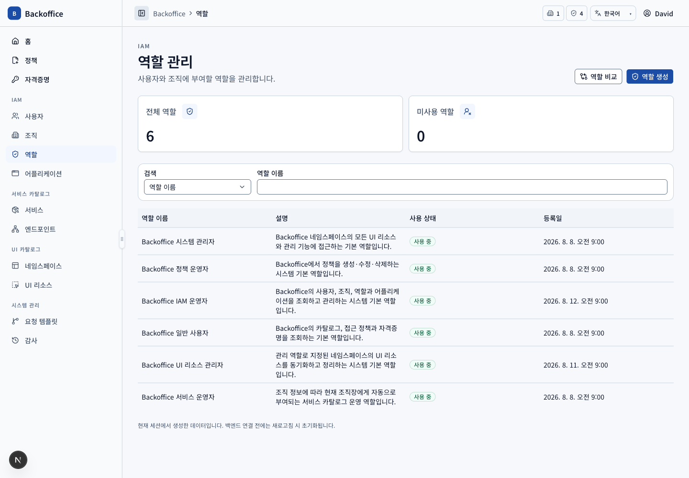
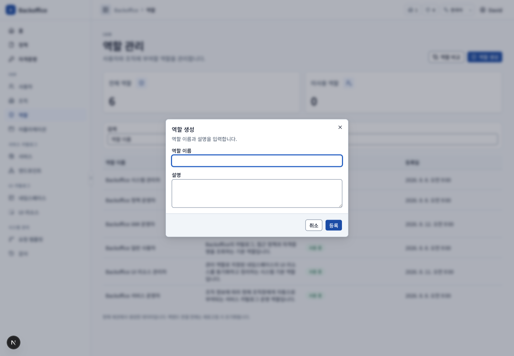
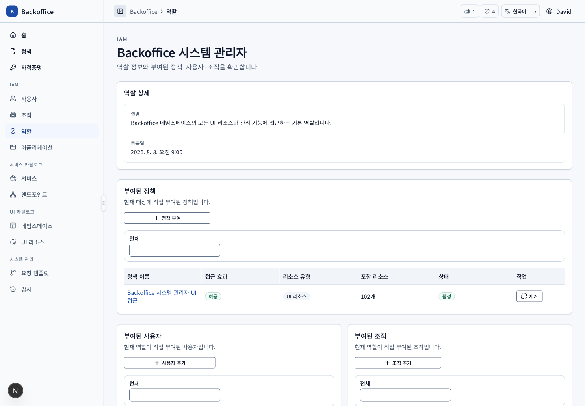

# 역할 메뉴 PRD

## 개요

- 목표: 사용자·조직에 부여할 역할과 역할의 정책 묶음을 운영한다.
- routes: `/roles`, `/roles/{roleId}`
- 주 사용자: IAM 운영자, 시스템 관리자
- 원본: UI `ROL-001~109`, 서버 `ROL-S001~005`, `IAM-S003`

## 대표 화면

| 생성                                                | 상세                                  |
| --------------------------------------------------- | ------------------------------------- |
|  |  |

## 사용자 시나리오

| ID         | 사용자·선행 조건                 | 사용자 흐름·완료 결과                                                                                | UI 요구사항                             | 필요한 서버 기능                                                                                | 화면                                    |
| ---------- | -------------------------------- | ---------------------------------------------------------------------------------------------------- | --------------------------------------- | ----------------------------------------------------------------------------------------------- | --------------------------------------- |
| ROL-SCN-01 | 역할 목록 view 권한              | 이름·설명·미사용 조건으로 조회하고 시스템 기본 역할을 구분한다. 두 역할은 검색 후 비교한다.          | `ROL-001~003`, `ROL-005`, `ROL-108~109` | 직접 부여 사용자·조직·정책과 미사용 여부, 비교용 리소스 범위 query (`ROL-S001~002`)             |           |
| ROL-SCN-02 | 역할 생성 action 권한            | 고유 이름과 설명을 입력해 역할을 생성한다.                                                           | `ROL-004`, `COM-005`, `COM-028`         | 권한, 대소문자 무시 이름 중복과 길이 검증 (`ROL-S001`, `ROL-S003`)                              |  |
| ROL-SCN-03 | 상세 view 권한                   | 직접 부여 사용자·조직과 정책을 독립 목록으로 조회한다.                                               | `ROL-101~104`, `COM-030`                | 관계별 query·total과 정책 리소스 유형·수 반환 (`ROL-S002`, `IAM-S003`, `POL-S005`)              |         |
| ROL-SCN-04 | 사용자·조직 연결 action 권한     | 미부여 후보를 검색해 복수 연결하고 특정 관계를 회수한다.                                             | `ROL-102~103`, `COM-013~014`            | 후보 query, 중복 방지, 시스템 역할 보호와 실효 권한 영향 계산 (`IAM-S003`, `ROL-S004`)          |    |
| ROL-SCN-05 | 정책 부여 action 권한            | 활성 정책을 검색해 역할에 부여하고, 회수 전 접근을 잃는 사용자를 확인한다.                           | `ROL-104~105`                           | 정책 존재·활성·중복, UI action 권한과 네임스페이스 관리 필수 정책 보호 (`ROL-S005`, `POL-S005`) |    |
| ROL-SCN-06 | 일반 역할, 수정·삭제 action 권한 | 이름·설명을 수정하거나 관계가 없는 역할을 영향 확인 후 삭제한다. 시스템 기본 역할은 변경하지 못한다. | `ROL-106`                               | 사용자·조직·정책·네임스페이스 관계 재검증과 보호 삭제 (`ROL-S004`)                              |  |

## 제외 범위

역할이 부여된 고유 사용자·조직 집계 카드는 MVP 이후 범위이며 역할 복제 기능은 제공하지 않는다.
