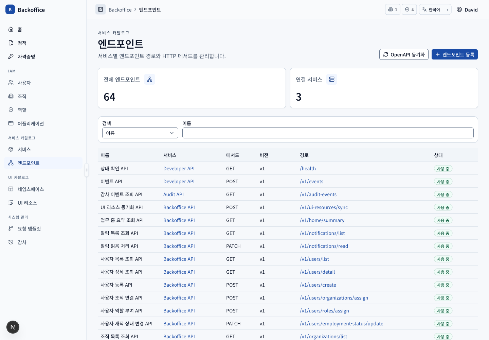
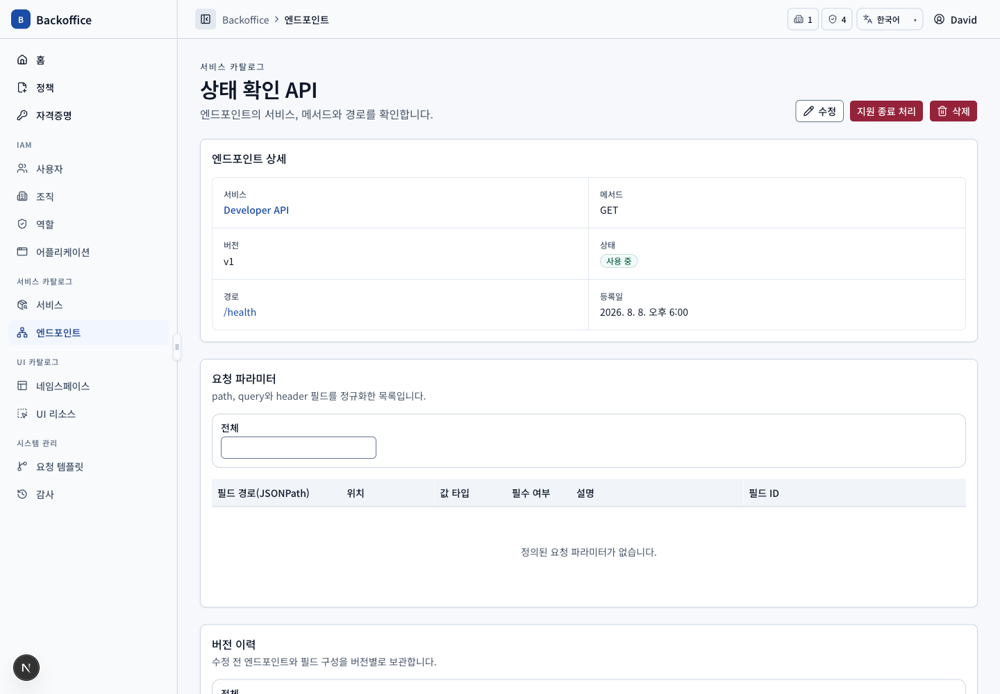
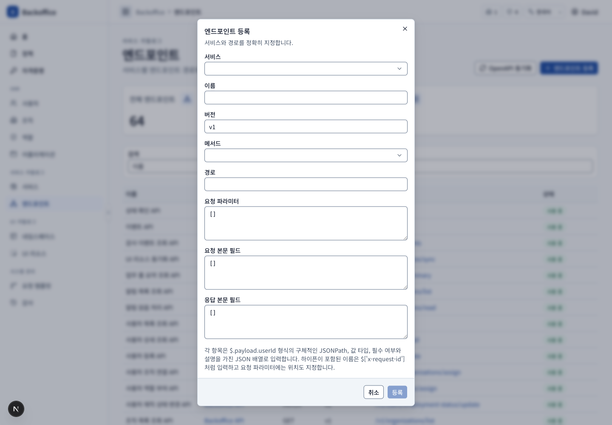
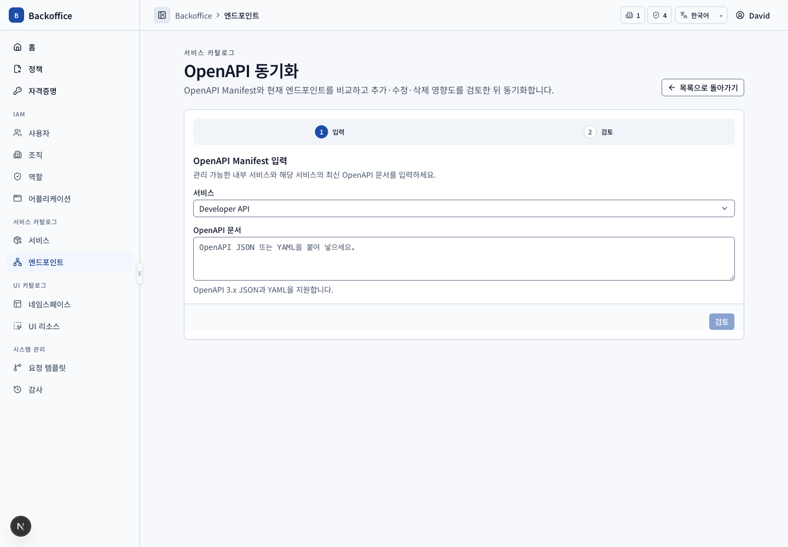

# 엔드포인트 메뉴 PRD

## 개요

- 목표: 내부 서비스의 접근 대상과 정규화된 요청·응답 필드를 개별 또는 OpenAPI 동기화로 관리한다.
- routes: `/service-endpoints`, `/service-endpoints/{endpointId}`, `/service-endpoints/sync`
- 주 사용자: 카탈로그 조회 사용자, 서비스 운영자 조직장, 시스템 관리자
- 원본: UI `EPT-001~013`, 서버 `EPT-S001~009`

## 대표 화면

| 목록                                          | 상세                                            |
| --------------------------------------------- | ----------------------------------------------- |
|  |  |

| 등록                                                          | OpenAPI 동기화                                  |
| ------------------------------------------------------------- | ----------------------------------------------- |
|  |  |

## 사용자 시나리오

| ID         | 사용자·선행 조건                               | 사용자 흐름·완료 결과                                                                                                                        | UI 요구사항                         | 필요한 서버 기능                                                                                          | 화면                                        |
| ---------- | ---------------------------------------------- | -------------------------------------------------------------------------------------------------------------------------------------------- | ----------------------------------- | --------------------------------------------------------------------------------------------------------- | ------------------------------------------- |
| EPT-SCN-01 | 목록 view 권한                                 | 서비스·method·path·이름으로 검색하고 method는 좁은 Badge 컬럼, path는 host 없이 확인한다.                                                    | `EPT-001~002`, `EPT-009`, `COM-027` | 활성 내부 서비스 범위의 endpoint filter·pagination·total (`EPT-S001~003`)                                 |           |
| EPT-SCN-02 | 상세 view 권한                                 | method/path와 query·header·request/response body 필드를 위치별 목록으로 조회한다. JSONPath로 특정 필드를 식별한다.                           | `EPT-003`, `EPT-009`                | 엔드포인트·정규화 필드 전용 DTO, 안정 UUID·위치·JSONPath·타입·필수 여부 (`EPT-S002`, `EPT-S004`)          |         |
| EPT-SCN-03 | 관리 가능한 INTERNAL 서비스와 등록 action 권한 | 서비스·이름·method·path를 입력해 등록한다. EXTERNAL 서비스는 후보에 없다.                                                                    | `EPT-004`                           | 소유 조직 관리 범위, service type/status, 동일 서비스 path 중복과 path 형식 검증 (`EPT-S001`, `EPT-S003`) |  |
| EPT-SCN-04 | 상세 수정 action 권한                          | 상세에서 엔드포인트와 정규화 필드를 수정하고 변경 영향·버전 snapshot을 확인한다.                                                             | `EPT-010`, `EPT-012`                | 동일 위치+JSONPath UUID 유지, 필드 diff, 정책·자격증명 영향과 버전 이력 (`EPT-S005`, `EPT-S007`)          |  |
| EPT-SCN-05 | 동기화 action·API·서비스 관리 범위 보유        | 내부 서비스를 선택하고 OpenAPI JSON/YAML을 입력한다. 검토에서 추가·수정·삭제·유지와 정책·자격증명·사용자 영향을 확인해 선택 작업만 반영한다. | `EPT-011`, `EPT-013`, `COM-026`     | OpenAPI 3.x 정규화, 최신 데이터 재분석, 참조 삭제 차단과 원자적 sync (`EPT-S006`)                         |         |
| EPT-SCN-06 | 동기화 완료                                    | 영향 사용자에게 중복 제거 알림을 보내고 수행자·작업별 diff·영향을 감사에 기록한다.                                                           | `EPT-011`, `EPT-013`                | 비동기 알림과 감사 이벤트, 서비스 상세 연결 (`EPT-S008`, `AUD-S002~004`)                                  |         |
| EPT-SCN-07 | 삭제 action 권한                               | 상세에서 삭제를 시작하고 정책·자격증명이 참조하면 차단 사유를 확인한다.                                                                      | `EPT-010`, `EPT-013`                | 관리 범위와 참조 무결성, 영향 preview, 원자적 삭제 (`EPT-S003`, `EPT-S006~007`)                           |  |
