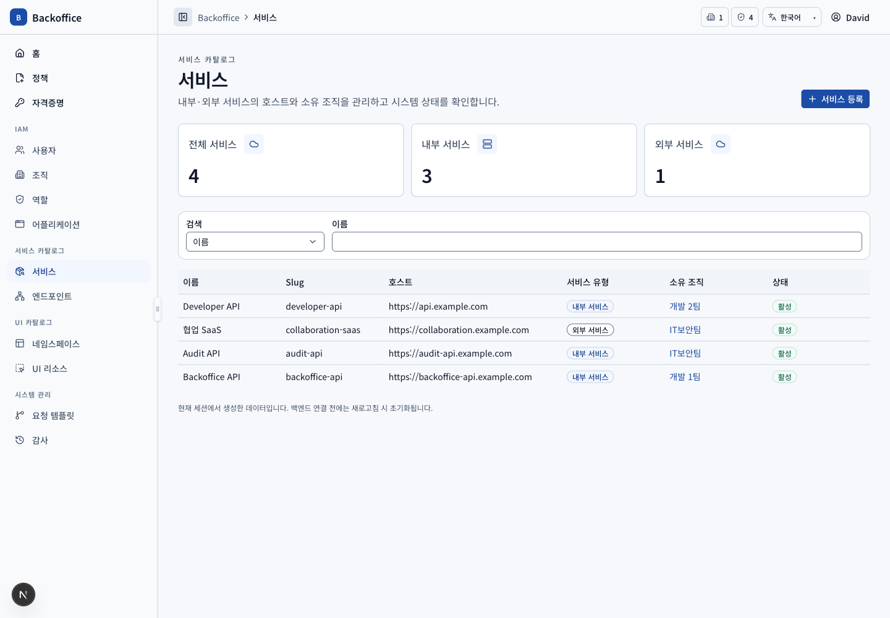
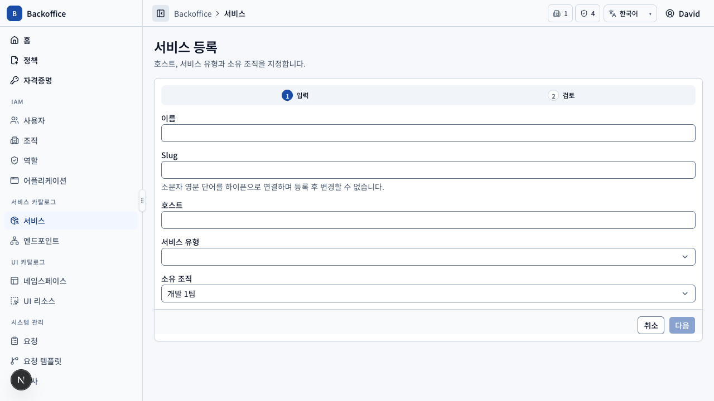
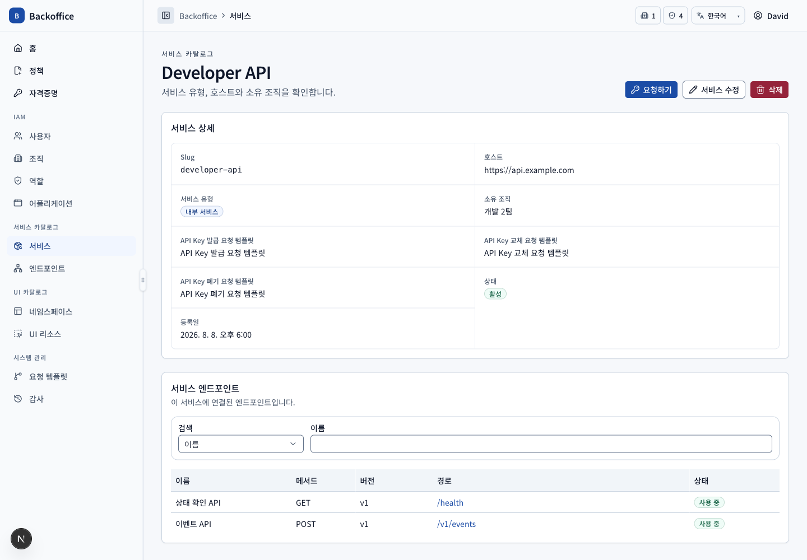

# 서비스 메뉴 PRD

## 개요

- 목표: 접근 대상 엔드포인트를 제공하는 내부 서비스와 엔드포인트가 없는 외부 SaaS를 카탈로그로 관리한다.
- routes: `/services`, `/services/new`, `/services/{serviceId}`, `/services/{serviceId}/edit`
- 주 사용자: 모든 카탈로그 조회 사용자, 서비스 운영자 조직장, 시스템 관리자
- 원본: UI `SVC-001~012`, 서버 `SVC-S001~006`

## 대표 화면

| 등록                                                   | 상세                                       |
| ------------------------------------------------------ | ------------------------------------------ |
|  |  |

## 사용자 시나리오

| ID         | 사용자·선행 조건                        | 사용자 흐름·완료 결과                                                                                                                     | UI 요구사항                                    | 필요한 서버 기능                                                                                                      | 화면                                       |
| ---------- | --------------------------------------- | ----------------------------------------------------------------------------------------------------------------------------------------- | ---------------------------------------------- | --------------------------------------------------------------------------------------------------------------------- | ------------------------------------------ |
| SVC-SCN-01 | 카탈로그 목록 view 권한                 | 이름·slug·유형·소유 조직으로 검색하고 INTERNAL/EXTERNAL을 한국어 Badge로 확인한다.                                                        | `SVC-001~004`                                  | 권한 범위 서비스 filter·pagination·total과 시스템 상태 반환 (`SVC-S001~002`)                                          |           |
| SVC-SCN-02 | 시스템 관리자 또는 서비스 운영자 조직장 | 전용 페이지에서 이름·kebab-case 불변 slug·host·유형을 입력하고 검토한다. 일반 운영자는 소유 조직이 자동 적용되며 성공 후 상세로 이동한다. | `SVC-004~005`, `SVC-012`, `COM-026`            | 역할·재직 조직장·관리 조직 범위, slug/host 고유성·형식과 활성 템플릿 자동 연결 (`SVC-S001`, `SVC-S003`, `SVC-S005`)   |    |
| SVC-SCN-03 | 상세 view 권한                          | 기본 정보와 INTERNAL 서비스의 엔드포인트 목록을 조회하고 자격증명 요청으로 이동한다. EXTERNAL은 엔드포인트 섹션을 제공하지 않는다.        | `SVC-007~008`, `KEY-013`                       | 서비스 상세·엔드포인트 전용 query, 외부 서비스 엔드포인트 금지 (`SVC-S002`, `SVC-S004`, `EPT-S002`)                   |         |
| SVC-SCN-04 | 소유 조직장 또는 시스템 관리자          | 상세에서 수정 페이지로 이동해 이름·host·유형·소유 조직을 입력·검토하되 slug는 변경하지 않고 저장 후 상세로 돌아온다.                      | `SVC-005~006`, `SVC-009`, `SVC-012`, `COM-026` | 관리 범위와 slug 불변, 엔드포인트 존재 시 EXTERNAL 전환·연결 자격증명 시 소유 조직 변경 거부 (`SVC-S003`, `SVC-S006`) |  |
| SVC-SCN-05 | 삭제 action 권한                        | 연결 리소스 영향을 확인하고 엔드포인트·자격증명·요청이 없는 서비스만 삭제한다.                                                            | `SVC-009`                                      | 최신 참조 무결성과 소유 조직 권한을 transaction에서 재검증 (`SVC-S003`, `SVC-S006`)                                   |  |

## 제외 범위

MVP에서는 등록 시 소유 조직과 자격증명 요청 템플릿을 선택하지 않는다. 권한 관계와 처리 유형에 따라 서버가 자동 결정한다(`SVC-005-P1`, `SVC-012-P1`).
