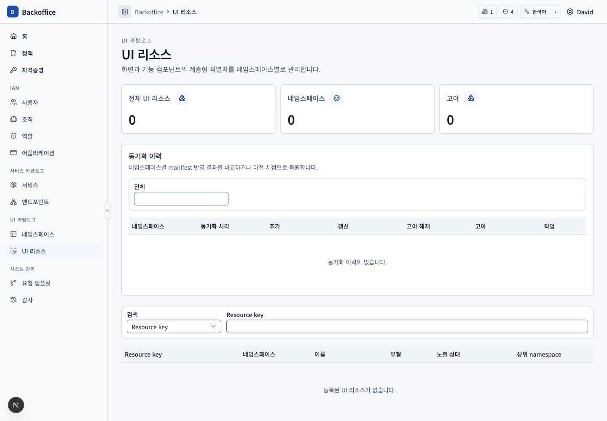
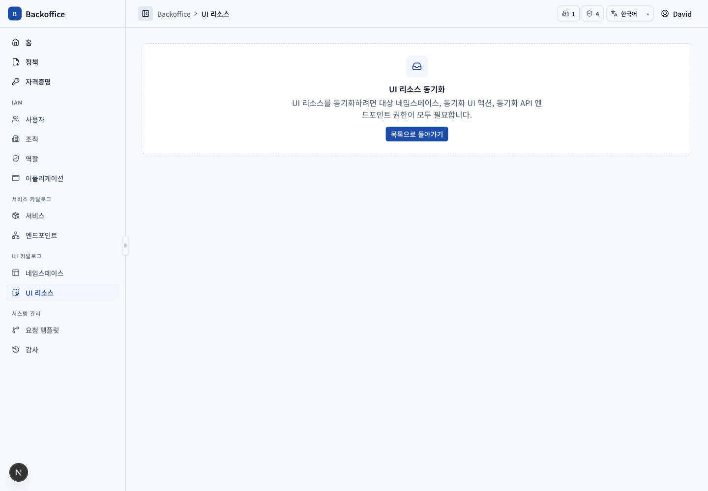

# UI 리소스 메뉴 PRD

## 개요

- 목표: 코드 manifest의 메뉴·view·component/action 식별자를 네임스페이스별로 동기화하고 노출 상태·고아·이력을 관리한다.
- routes: `/ui-resources`, `/ui-resources/sync`
- 주 사용자: 대상 네임스페이스 관리 역할 보유자, UI 리소스 관리자, 시스템 관리자
- 원본: UI `UIR-003~021`, 서버 `UIR-S001~009`

## 대표 화면

| 목록                                            | 동기화 입력·검토                                  |
| ----------------------------------------------- | ------------------------------------------------- |
|  |  |

## 사용자 시나리오

| ID         | 사용자·선행 조건                                       | 사용자 흐름·완료 결과                                                                                                 | UI 요구사항                            | 필요한 서버 기능                                                                                         | 화면                                         |
| ---------- | ------------------------------------------------------ | --------------------------------------------------------------------------------------------------------------------- | -------------------------------------- | -------------------------------------------------------------------------------------------------------- | -------------------------------------------- |
| UIR-SCN-01 | 목록 view 권한                                         | 네임스페이스·key·이름·유형·실효 노출·상위 key로 최대 20건씩 조회한다.                                                 | `UIR-003`, `UIR-005`, `UIR-016~017`    | UI 리소스 전용 filter·pagination·total과 상위 계층 실효 상태 계산 (`UIR-S001`, `UIR-S004`)               |         |
| UIR-SCN-02 | 개별 상태 변경 action 권한                             | 리소스 노출 Switch를 변경하고 상위 비활성·고아면 하위의 실효 숨김을 확인한다.                                         | `UIR-015`                              | 자신과 모든 상위 리소스의 활성·고아 상속, 권한 검증과 상태 저장 (`UIR-S004`)                             |    |
| UIR-SCN-03 | namespace 관리 역할 + sync view/action + sync API 정책 | 관리 가능한 namespace와 YAML/JSON manifest를 입력하고 검토 단계로 이동한다.                                           | `UIR-006`, `UIR-014`                   | manifest schema·크기·namespace 일치와 세 종류 권한의 교집합 검증 (`UIR-S002`, `UIR-S005~006`)            |       |
| UIR-SCN-04 | 유효 manifest 분석 완료                                | resource key 정렬 목록에서 포함 대상을 선택하고 추가·갱신·정상 복귀·고아 예정 및 관리 역할 전체 부여 여부를 검토한다. | `UIR-006`, `UIR-014`, 동기화 후보 규칙 | 현재 snapshot과 선택 집합 diff, 상하위 선택 일관성, 최신 데이터 재검증 (`UIR-S003`, `UIR-S005`)          |    |
| UIR-SCN-05 | 동기화 확정                                            | 선택한 변경을 반영하고 마지막 동기화 시각과 snapshot을 기록한다. 제외 리소스는 삭제하지 않고 고아로 남긴다.           | `UIR-006`, `UIR-009`                   | 원자적 upsert·orphan marking·history 저장, 관리 역할 정책 선택 갱신 (`UIR-S003`, `UIR-S005`, `UIR-S009`) |       |
| UIR-SCN-06 | 고아 삭제 action 권한                                  | 목록에서 고아를 복수 선택하고 일부를 보류한 뒤 삭제한다.                                                              | `UIR-009`                              | 고아 상태·참조·권한 재검증과 선택 삭제 (`UIR-S003`, `UIR-S006`)                                          |    |
| UIR-SCN-07 | 비교·복원 action 권한                                  | namespace별 두 동기화 시점을 비교하거나 이전 snapshot을 복원하고 코드 manifest 불일치를 확인한다.                     | `UIR-021`                              | history pagination, snapshot diff, 복원 시 현재 전용 리소스 고아 처리와 감사 (`UIR-S009`)                |  |

## 식별 규칙

key는 lowerCamelCase depth를 `:`로 연결한다. 메뉴→view→component/action 상위를 상속하며 네임스페이스가 다르면 같은 key도 격리된다. export 명령 사용법은 README에만 두고 화면에는 가이드 카드를 표시하지 않는다.
