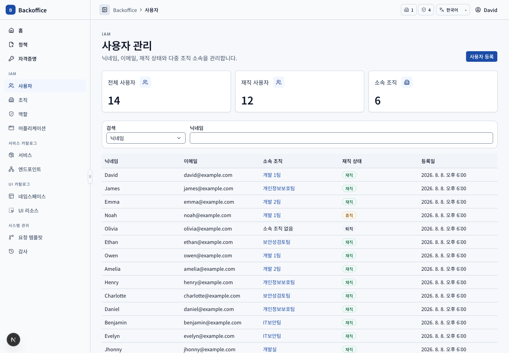
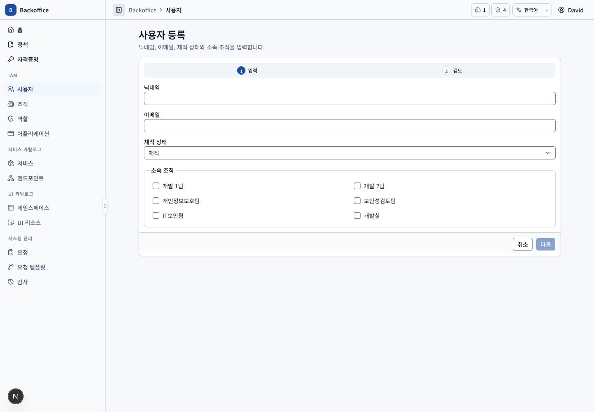
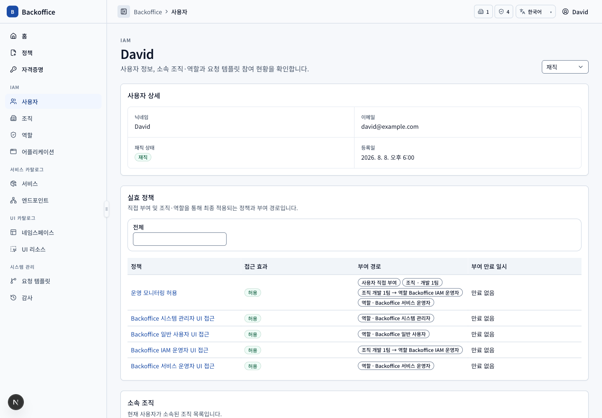

# 사용자 메뉴 PRD

## 개요

- 목표: 사용자 기본 정보와 다중 조직·역할 관계, 실효 정책을 IAM 권한 범위에서 운영한다.
- routes: `/users`, `/users/new`, `/users/{userId}`
- 주 사용자: Backoffice IAM 운영자, Backoffice 시스템 관리자
- 원본: UI `USR-001~108`, 서버 `USR-S001~006`, `IAM-S001`, `IAM-S003`, `IAM-S006`

## 대표 화면

| 등록                                                | 상세                                    |
| --------------------------------------------------- | --------------------------------------- |
|  |  |

## 사용자 시나리오

| ID         | 사용자·선행 조건                    | 사용자 흐름·완료 결과                                                              | UI 요구사항                             | 필요한 서버 기능                                                                                         | 화면                                       |
| ---------- | ----------------------------------- | ---------------------------------------------------------------------------------- | --------------------------------------- | -------------------------------------------------------------------------------------------------------- | ------------------------------------------ |
| USR-SCN-01 | IAM 목록 view 권한                  | 닉네임·이메일·조직·재직 상태 조건으로 최대 20명씩 조회하고 행으로 상세에 진입한다. | `USR-001~004`, `COM-020`, `COM-023~024` | 권한 검증, 서버 filter·pagination·total, IAM 운영자에게 퇴직자 포함 (`USR-S001~002`)                     |              |
| USR-SCN-02 | 사용자 등록 action·create view 권한 | 닉네임·이메일·재직 상태·복수 조직을 입력하고 검토한 뒤 등록하며 상세로 이동한다.   | `USR-005`, `COM-005`, `COM-026`         | 형식·중복·조직 존재·최소 소속 검증과 원자적 생성 (`USR-S001`, `USR-S003`, `IAM-S001`)                    |       |
| USR-SCN-03 | 사용자 상세 view 권한               | 기본 정보, 소속 조직, 역할과 실효 정책을 조회하고 연결된 상세로 이동한다.          | `USR-101`, `USR-103~104`, `USR-108`     | 직접·조직 경유 관계와 deny 우선 실효 정책·부여 경로 반환 (`IAM-S003`, `IAM-S006`, `POL-S005`)            |            |
| USR-SCN-04 | 시스템 관리자 action 권한           | 상세에서 재직 상태를 변경한다. 목록에서는 상태를 Badge로만 본다.                   | `USR-004`, `USR-102`                    | 시스템 관리자 권한, 퇴직 전 진행 요청·조직장 관계·최소 소속 영향 검증 (`USR-S003~004`, `USR-S006`)       |  |
| USR-SCN-05 | 조직·역할 연결 action 권한          | 미연결 후보를 검색·페이지 탐색해 복수 연결하거나 특정 관계를 확인 후 제거한다.     | `USR-103~104`, `COM-009`, `COM-013~014` | 후보 query, 중복 방지, 관계 보호와 변경 영향 계산, 원자적 연결·회수 (`IAM-S001`, `IAM-S003`, `USR-S003`) |       |
| USR-SCN-06 | IAM 정책 미보유 일반 사용자         | LSB에 사용자가 없고 직접 URL 접근 시 403을 본다.                                   | `USR-006`, `COM-025`, `COM-029`         | 목록·상세 route와 API에서 동일하게 접근 거부 (`USR-S002`, `COM-S003`)                                    |     |

## 제외 범위

자격증명 이력, 요청 이력과 고정 사용자 요청 템플릿 참여 목록은 MVP 이후 범위다(`USR-105`, `USR-109`).
